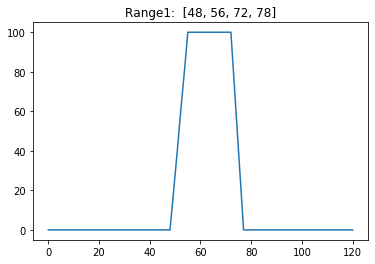

2.05 Stay in Instrument Range
=============================

In the Previous example the melody could get **off track** and get
further away from the **good sounding instrument range.** It was also
possible that it left the scale and created an error.

The Melody generation has new concept. The **intervals are now generated
step by step (intvl\_next**) with an for-loop. Each interval is first
added to the melody and then checked for acceptance.

The **range provides the acceptance values** over the seven
Midi-Octaves. At the moment a linear range is used, but it could be
easily be changed in a Beta-Curve.

The **acceptance function** decides whether the **proposed interval is
accepted** or if an new proposal must be made.

1. first the acceptance values of the current and proposed note are read
   out of the range.
2. then the acceptance value of the current note is divided by the
   acceptance value of the proposed note.
3. This quotient is compared with an random number from 0 to 1. If
   Quotient > Random number, the proposed interval is accepted.
   Otherwise an new proposition is requested.

This is an **Metropolis-Hasting Algorithm**.

.. code:: python3

    from pyknon.genmidi import Midi
    from pyknon.music import Rest, Note, NoteSeq
    import numpy as np
    import matplotlib.pyplot as plt

**Instruments:** Available are at lest the 128 General-Midi (GM)
Instruments. Depending on the sound-fonts there is a bigger choice. A
list of the GM instruments can be found here.
https://jazz-soft.net/demo/GeneralMidi.html

.. code:: python3

    major = np.array([ 0, 2, 4, 5, 7, 9, 11])
    minor = np.array([ 0, 2, 3, 5, 7, 8, 10])
    blues = np.array([ 0, 3, 5, 6, 7, 10])
    C7 = np.array([ 0, 4, 7, 10]) 
    CM7 = np.array([ 0, 4, 7, 11])
    
    
    def scale_create(tones):
        tones = np.asarray(tones)   # tones which form chord or scale in the first octave (0-11)
        if any(tones > 11):             # tones over one octave?
            tones = np.mod(tones,12)    # set the thones in one octave
            tones = np.sort(tones)      # sort the tones new
            tones = np.unique(tones)    # remove duplicate tones
        octave = np.repeat( np.linspace(0,108, num=10), len(tones))
        scale = np.add( octave, np.tile(tones, 10)) # add element wise octave and note
        return scale.astype(int)
        
    def fade(start,end,steps):  # currently not in use
        fade = np.around( np.linspace(start,end,num=steps))
        fade = fade.astype(int)
        return fade
    
    def ran_duration(duration, prob_duration, melody_len):    
        duration= np.asarray(duration)                  # this are the allowed durations of the notes
        prob_duration = np.asarray(prob_duration)       # this are the probabilities how often each will occure
        prob_duration = prob_duration/np.sum(prob_duration) 
        rythem = np.r_[np.random.choice(duration, size=melody_len, p=prob_duration)]
        return rythem
        
    def ran_volume(volume, prob_volume, melody_len):
        volume = np.asarray(volume, dtype=int)         # this are the allowed volumes of thenotes
        prob_volume = np.asarray(prob_volume)          # this are the probabilities how often each volume will occure
        prob_volume = prob_volume/np.sum(prob_volume) 
        volumes = np.r_[np.random.choice(volume, size=melody_len, p=prob_volume)]
        return volumes
    
    def intvl_melody(intvl, prob_intvl, melody_len):  #Interval Melody  # currently not in use 
        intvl = np.asarray(intvl)            # Possible interval
        prob_intvl = np.asarray(prob_intvl)         # Probability of each interval
        prob_intvl = prob_intvl/np.sum(prob_intvl)
        intervals = np.r_[np.random.choice(intvl, size=melody_len, p=prob_intvl)] 
        imelody = np.cumsum(intervals)
        return imelody

**linear\_range:** Generates the acceptance values. They define the
range in which the instrument can play.

.. code:: python3

    def liniar_range(r_start, r_top, r_edge, r_end, title): # acceptance range of the instrument 
        h = 100 # hight of acceptance function
        a_range = np.zeros(121, dtype=int)  # only to midi =120 as 127 is not a complete octave
        np.put(a_range, range(r_start,r_top),  np.linspace(0,h, num=(r_top -r_start)) )
        np.put(a_range, range(r_top, r_edge),  np.linspace(h,h, num=(r_edge-r_top  )) )
        np.put(a_range, range(r_edge, r_end),  np.linspace(h,0, num=(r_end -r_edge )) )
        
        fig, ax = plt.subplots()
        ax.plot(range(121), a_range)
        plt.title(str(title)+':  '+str([r_start, r_top, r_edge, r_end]))
        plt.show()
        return a_range
        

**i\_last\_note:** finds the i value of the last note in the actual
scale.

.. code:: python3

    def i_last_note(note, scale):
        i_note = (np.abs(scale - note)).argmin()
        return i_note

**intvl\_next** is a modification of intvl\_melody. But it does only
creates **one** interval and not an array/melody in one time.

.. code:: python3

    def intvl_next(intvl, prob_intvl):  #singel interval
        intvl = np.asarray(intvl)            # Possible interval
        prob_intvl = np.asarray(prob_intvl)         # Probability of each interval
        prob_intvl = prob_intvl/np.sum(prob_intvl)
        interval = np.random.choice(intvl, size=1, p=prob_intvl)
        return interval[0]

**acceptance** decides with an Metropolis-Hasting Algorithm whether the
Proposed not is accepted.

.. code:: python3

    # x is the aceptance value of the current note, while x_new is it from the proposoal note. 
    
    def acceptance(x, x_new):
        if x_new < 1:
            if x < 1:
                print('start_note not in range')
                return 
        quot = x_new/x
        if quot >= 1: return True
        if np.random.uniform(0,1)< quot: return True
        else: return False
      

.. code:: python3

    def acceptance_melody(intvl, prob_intvl, scale, start_note, a_range, melody_len):
        melody = np.zeros(melody_len, dtype=int)
        melody[0] = scale[i_last_note(start_note,scale)]
    
        for npn in range(1, melody_len):  
            accept = False    
            while not accept:       # aslong acept == False
                inote = i_last_note(melody[npn-1],scale)
                inote_next = inote + intvl_next(intvl, prob_intvl)         # add current not with Proposition
                accept_val = a_range[[melody[(npn-1)],scale[inote_next]]]  # get acceptance values
                accept = acceptance(accept_val[0],accept_val[1])
            melody[npn] = scale[inote_next]
        print('melody:',melody)
        return melody
                
            

**tune\_P:** Changing the scale creating method.

.. code:: python3

    def tune_P():
        tune_name = 'tune_P'  
        #np.random.seed(23)
        melody_len = 60
        scale = scale_create(blues)
        
        range_1 = liniar_range(48,56,72,78,'Range1')
        melody1 = acceptance_melody([-2,-1, 0, 1, 2],[1, 3, 1, 3, 1],scale, 60, range_1, melody_len)
        rythem1 = ran_duration([1/8, 1/4,1/2], [4,2,1], melody_len)
        volumes1 = ran_volume([0,120], [1,8], melody_len )
    
        notes1 = NoteSeq( [Note(no,octave=0, dur=du, volume=vo) for no,du,vo in zip(melody1,rythem1,volumes1)] )
    
        instruments = [24]
        notes = [notes1]
        return notes, instruments,tune_name

.. raw:: html

     <audio controls="controls" src="https://raw.githubusercontent.com/schuhva/Music-Generation/master/doc/releases/2.05/tune_P.flac" type="audio/flac"></audio>
     tune_P    
     
      
     tune_P     

.. code:: python3

    
    def gen_midi():
    #     squezze into a MIDI framework
        notes, instruments, tune_name = tune_P() #  <--- select a tune  <<--     <<<<<<<<<--- select a tune -----
        nTracks = len(notes)
        
        m = Midi(number_tracks=nTracks, tempo=120, instrument=instruments)
        for iTrack in range(nTracks):
            m.seq_notes(notes[iTrack], track=iTrack)
    
        #--- write the MIDI file -----
        midi_file_name = tune_name +'.mid'   # set the name of the file
        m.write(midi_file_name)
        return midi_file_name

Midi: Play and Generate audio-file
----------------------------------

External players offered a better sound quality in comparison with
python libraries. We use **VLC** and **Musescore**. The **soundfont**
for the VLC player is defined over the command line. For Musescore
through the Gui in the preferences.

.. code:: python3

    import subprocess
    default_soundfont = '/usr/share/sounds/sf3/MuseScore_General.sf3'
    
    def midi_play(midi_in, soundfont= default_soundfont):
        subprocess.call(['cvlc', midi_in , 'vlc://quit', '--soundfont', '/home/viturin/-vitis/Documents/MuseScore2/Soundfonts/Compifont_13082016.sf2'])   # cvlc = vlc without gui
        
    def midi_audio(midi_in, name_out = 'none', soundfont= default_soundfont):
        if name_out == 'none' :
            name_out = midi_in.replace('.mid', '.flac')
        else:
            name_out = name_out + '.flac'
        subprocess.call(['mscore', '-o', name_out, midi_in]) # -o = export as
    
    def midi_png(midi_in, name_out = 'none'):
        if name_out == 'none' :
            name_out = midi_in.replace('.mid', '.png')
        else:
            name_out = name_out + '.png'
        subprocess.call(['mscore', '-o', name_out, '-T', '2', midi_in]) # -o = export as , -T 2 = cut page with 2 pixel

.. code:: python3

    ######---  Main  ---######
    midi_file_name = gen_midi()
    
    midi_play(midi_file_name)
    midi_audio(midi_file_name)
    midi_png(midi_file_name)

.. parsed-literal::

    melody: [60 55 60 58 60 55 54 55 58 60 60 65 66 63 66 63 66 67 70 67 70 72 70 72
     67 72 72 70 72 70 72 72 67 67 67 67 67 72 70 75 72 70 70 72 70 72 70 67
     70 66 70 70 67 70 66 65 65 63 66 63]

