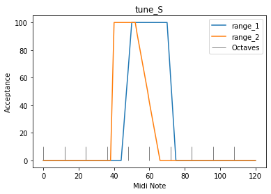

2.07 syncronize voices
======================

Till now the voices had to have the same number of notes to stop at the
same time. That means the probability of note lengths had to be the
same. The problem with the chord pattern was that the voices could shift
and both played in a different chord.

Now the length of the piece is defined by the number of beats. The chord
changes are determined by the beat number. The number of notes is now
also independent of the piece length.

.. code:: python3

    from pyknon.genmidi import Midi
    from pyknon.music import Rest, Note, NoteSeq
    import numpy as np
    import matplotlib.pyplot as plt

**Instruments:** Available are at lest the 128 General-Midi (GM)
Instruments. Depending on the sound-fonts there is a bigger choise. A
list of the GM instruments can be found here.
https://jazz-soft.net/demo/GeneralMidi.html

.. code:: python3

    major = np.array([ 0, 2, 4, 5, 7, 9, 11])
    minor = np.array([ 0, 2, 3, 5, 7, 8, 10])  
    C7 = np.array([ 0, 4, 7, 10]) 
    CM7 = np.array([ 0, 4, 7, 11])
    Cm7 = np.array([ 0, 3, 7, 10])
    Cm  = np.array([ 0, 3, 7])
    C   = np.array([ 0, 4, 7])
    bass= np.array([ 0])

.. code:: python3

    
    def scale_create(tones):
        tones = np.asarray(tones)   # tones which form chord or scale in the first octave (0-11)
        if any(tones > 11):             # tones over one octave?
            tones = np.mod(tones,12)    # set the thones in one octave
            tones = np.sort(tones)      # sort the tones new
            tones = np.unique(tones)    # remove duplicate tones
        octave = np.repeat( np.linspace(0,108, num=10), len(tones))
        scale = np.add( octave, np.tile(tones, 10)) # add element wise octave and note
        return scale.astype(int)
        
    def fade(start,end,steps): # currently not in use
        fade = np.around( np.linspace(start,end,num=steps))
        fade = fade.astype(int)
        return fade
    
    def ran_volume(volume, prob_volume, melody_len):
        volume = np.asarray(volume, dtype=int)         # this are the allowed volumes of thenotes
        prob_volume = np.asarray(prob_volume)          # this are the probabilities how often each volume will occure
        prob_volume = prob_volume/np.sum(prob_volume) 
        volumes = np.r_[np.random.choice(volume, size=melody_len, p=prob_volume)]
        return volumes
    
    #   currently not in use
    def intvl_melody(intvl, prob_intvl, melody_len):  #Interval Melody   
        intvl = np.asarray(intvl)            # Possible interval
        prob_intvl = np.asarray(prob_intvl)         # Probability of each interval
        prob_intvl = prob_intvl/np.sum(prob_intvl)
        intervals = np.r_[np.random.choice(intvl, size=melody_len, p=prob_intvl)] 
        imelody = np.cumsum(intervals)
        return imelody
    
    
    #   liniar_range: Generates an range in which the instrument can play. 
    def liniar_range(r_start, r_top, r_edge, r_end): # acceptance range of the instrument 
        h = 100 # hight of acceptance function
        a_range = np.zeros(121, dtype=int)  # only to midi =120 as 127 is not a complete octave
        np.put(a_range, range(r_start,r_top),  np.linspace(0,h, num=(r_top -r_start)) )
        np.put(a_range, range(r_top, r_edge),  np.linspace(h,h, num=(r_edge-r_top  )) )
        np.put(a_range, range(r_edge, r_end),  np.linspace(h,0, num=(r_end -r_edge )) )
    
        return a_range
        
    #   i_last_note: finds de i value of the last not in the actual scale.
    def i_last_note(note, scale):
        i_note = (np.abs(scale - note)).argmin()
        return i_note
    
    #   intvl_next is a modification of intvl_melody. But it does only creats one interval and not an array/melody in one time.
    def intvl_next(intvl, prob_intvl):  #singel interval
        intvl = np.asarray(intvl)            # Possible interval
        prob_intvl = np.asarray(prob_intvl)         # Probability of each interval
        prob_intvl = prob_intvl/np.sum(prob_intvl)
        interval = np.random.choice(intvl, size=1, p=prob_intvl)
        return interval[0]
    
    #   acceptance: accepts and refuses proposed nots with Metropolis-Hasting Algorythem.
    #     x is the value in the aceptance range of the current note, while x_new is it from the proposoal note
    def acceptance(x, x_new):
        if x_new < 1:
            if x < 1:
                print('start_note not in range')
                return 
        quot = x_new/x
        if quot >= 1: return True
        if np.random.uniform(0,1)< quot: return True
        else: return False

**ran\_duration** was modified such that the rythem has the length of
melody\_len (nummbers of beats)

.. code:: python3

    def ran_duration(duration, prob_duration, melody_len):    
        duration= np.asarray(duration)                  # this are the allowed durations of the notes
        prob_duration = np.asarray(prob_duration)       # this are the probabilities how often each will occure
        prob_duration = prob_duration/np.sum(prob_duration)
        cumsum, melody_len, rythem = 0, melody_len/4 , np.asarray([])  #melody_len/4 as note values are quarter
        while cumsum < melody_len:
            note_len = np.random.choice(duration, p=prob_duration)
            cumsum = cumsum + note_len
            rythem = np.append(rythem,note_len)
        return rythem , len(rythem)

**pattern\_gen** takes the chord pattern (scales): it reapeats the
pattern as long the melody is, and generates the beat number where the
chords change.

.. code:: python3

    def pattern_gen(scales,melody_len):
        scales = np.asarray(scales)
        bpb = 4  # beats per bar
        factor = int(np.trunc(melody_len/(np.sum(scales[:,0]) * bpb)) + 1) # factor rounded up: how many times is the pattern used
        change_times = np.cumsum(np.tile(scales[:,0],factor)) * bpb        # create change time list with factor
        change_times = np.concatenate((np.asarray([0]),change_times))[:-1] # add 0 at beginig remove last element
        
        for i in range(len(scales)):         # send scales to scale_create
            scales[i,1] = scale_create(scales[i,1])
        pattern = np.tile(scales,(factor,1))   # tile the scales as long the melody is
        pattern[:,0] = change_times    #insert change_times into scales
        pattern = np.delete(pattern, np.argwhere(pattern[:,0] >= melody_len) ,0) # remove unneeded scales
        
        return pattern

**acceptance\_melody** is trans formed such that it can read an process
the pattern varibel to a melody

.. code:: python3

    def acceptance_melody(intvl, prob_intvl, pattern, start_note, a_range, notenr, rythem):
        melody = np.zeros(notenr, dtype=int)
        cum_rythem = np.cumsum(rythem) *4
        cum_rythem = np.concatenate(([0],cum_rythem))[:-1] # add 0 at beginig remove last element
        scale_change = pattern[:,0]
        scale_nr =0
        scale = pattern[scale_nr,1]
        melody[0] = scale[i_last_note(start_note,scale)]
        
        for npn in range(1, notenr):  #npn: note per note (index)      
            scale_nr = np.ravel(np.argwhere(scale_change <= cum_rythem[npn-1])) [-1]     
            scale = pattern[scale_nr,1]
    
            accept = False    
            while not accept:       # aslong acept == False
                inote = i_last_note(melody[npn-1],scale)
                inote_next = inote + intvl_next(intvl, prob_intvl)         # add current not with Proposition
                accept_val = a_range[[melody[(npn-1)],scale[inote_next]]]  # get acceptance values
                accept = acceptance(accept_val[0],accept_val[1])
            #print('npn, len(melody),inote_next,len(scale)', npn, len(melody),inote_next,len(scale))
            melody[npn] = scale[inote_next]
        return melody

**plot\_range**: plot all ranges together

.. code:: python3

    def plot_range(ranges,labels,title):
        fig, ax = plt.subplots()
        plt.xlabel('Midi Note')
        plt.ylabel('Acceptance')
        plt.title(title)
    
        for a_range, lab in zip(ranges,labels):
            ax.plot(range(121), a_range,label= lab )
        ax.vlines(x=np.linspace(0,108, num=10), ymin=0, ymax=10, color='grey', label='Octaves',linewidth=1) # plot octaves
        plt.legend()
        plt.show()

**tune\_S:** The voices are now syncronized. 1. A diffrent note length
distribution is now possibel. 2. The chord change takes place at the
same time in both voices.

.. code:: python3

    def tune_S():
        tune_name = 'tune_S'  
        #np.random.seed(23)
        bar, bpb = 13, 4  # bar: Takt , bpb: beat per bar
        melody_len = bar * bpb
    
        scales = [[1,CM7],[1,Cm7+9],[1,Cm7+2],[1,C7+7]] #rythem Change
        #scales = [[4,C7],[2,C7+5],[2,C7],[1,C7+7],[1,C7+5],[2,C7]] # Blues  
        pattern = pattern_gen(scales, melody_len)
        
        range_1 = liniar_range(44,51,70,76)
        rythem1, notenr_1 = ran_duration([1/8, 1/4,1/2], [2,2,1], melody_len)
        melody1 = acceptance_melody([-2,-1, 0, 1, 2],[1, 3, 1, 3, 1],pattern, 60, range_1, notenr_1, rythem1)
        volumes1 = ran_volume([0,120], [1,5], notenr_1 )
        notes1 = NoteSeq( [Note(no,octave=0, dur=du, volume=vo) for no,du,vo in zip(melody1,rythem1,volumes1)] )
           
        range_2 = liniar_range(38,41,52,67)
        rythem2, notenr_2 = ran_duration([1/8, 1/4,1/2], [4,4,1], melody_len)
        melody2 = acceptance_melody([-2,-1, 0, 1, 2],[0, 3, 1, 3, 0],pattern, 46, range_2, notenr_2,rythem2)
        volumes2 = ran_volume([0,120], [0,8], notenr_2 )
        notes2 = NoteSeq( [Note(no,octave=0, dur=du, volume=vo) for no,du,vo in zip(melody2,rythem2,volumes2)] )
        
        plot_range([range_1,range_2],['range_1','range_2'],tune_name)
        instruments = [66,32]
        notes = [notes1,notes2]
        return notes, instruments,tune_name

.. raw:: html

     <audio controls="controls" src="https://raw.githubusercontent.com/schuhva/Music-Generation/master/doc/releases/2.07/tune_S.flac" type="audio/flac"></audio>
     tune_S  
     
      
     tune_S     

.. code:: python3

    
    def gen_midi():
    #     squezze into a MIDI framework
        notes, instruments, tune_name = tune_S() #  <--- select a tune  <<--     <<<<<<<<<--- select a tune -----
        nTracks = len(notes)
        
        m = Midi(number_tracks=nTracks, tempo=120, instrument=instruments)
        for iTrack in range(nTracks):
            m.seq_notes(notes[iTrack], track=iTrack)
    
        #--- write the MIDI file -----
        midi_file_name = tune_name +'.mid'   # set the name of the file
        m.write(midi_file_name)
        return midi_file_name

Midi: Play and Generate audio-file
----------------------------------

Externel players offered a better sound quality in comparison with
python liaberys. We use **VLC** and **Musescore**. The **soundfont** for
the VLC player is defined over the command line. For Musescore through
the Gui in the preferences.

.. code:: python3

    import subprocess
    default_soundfont = '/usr/share/sounds/sf3/MuseScore_General.sf3'
    
    def midi_play(midi_in, soundfont= default_soundfont):
        subprocess.call(['cvlc', midi_in , 'vlc://quit', '--soundfont', '/home/viturin/-vitis/Documents/MuseScore2/Soundfonts/Compifont_13082016.sf2'])   # cvlc = vlc without gui
        
    def midi_audio(midi_in, name_out = 'none', soundfont= default_soundfont):
        if name_out == 'none' :
            name_out = midi_in.replace('.mid', '.flac')
        else:
            name_out = name_out + '.flac'
        subprocess.call(['mscore', '-o', name_out, midi_in]) # -o = export as
    
    def midi_png(midi_in, name_out = 'none'):
        if name_out == 'none' :
            name_out = midi_in.replace('.mid', '.png')
        else:
            name_out = name_out + '.png'
        subprocess.call(['mscore', '-o', name_out, '-T', '2', midi_in]) # -o = export as , -T 2 = cut page with 2 pixel

.. code:: python3

    ######---  Main  ---######
    midi_file_name = gen_midi()
    
    midi_play(midi_file_name)
    midi_audio(midi_file_name)
    midi_png(midi_file_name)

