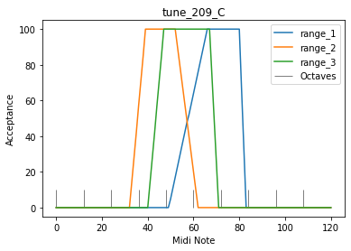

2.09 Some Examples
==================

Four Exampels with diffrent manually defined chord patterns.

Functions which ar no longer part of this development step are
**exported to the music\_generation.py file.** The file is found at the
**end** of the page.

.. code:: python3

    from pyknon.genmidi import Midi
    from pyknon.music import Rest, Note, NoteSeq
    from music_generation import *
    import numpy as np
    import matplotlib.pyplot as plt

.. code:: python3

    major = np.array([ 0, 2, 4, 5, 7, 9, 11])
    minor = np.array([ 0, 2, 3, 5, 7, 8, 10])  
    blues = np.array([ 0, 3, 5, 6, 7, 10])
    C7 = np.array([ 0, 4, 7, 10]) 
    CM7 = np.array([ 0, 4, 7, 11])
    Cm7 = np.array([ 0, 3, 7, 10])
    Cm  = np.array([ 0, 3, 7])
    Cdim   = np.array([ 0, 3, 6])
    C   = np.array([ 0, 4, 7])
    power = np.array([ 0,7])
    B = np.array([ 0])

tune\_2.09\_A
-------------

-  Chords: C Am Dm G
-  Strings playing chords
-  Organ for the base
-  Clarinet playing major scale

.. code:: python3

    def tune_209_A():
        tune_name = 'tune_209_A'  
        np.random.seed(154)
        bar, bpb = 13, 4  # bar: Takt , bpb: beat per bar
        melody_len = bar * bpb
    
        #scales = [[1,CM7],[1,Cm7+9],[1,Cm7+2],[1,C7+7]] #rythem Change
        #scales = [[4,C7],[2,C7+5],[2,C7],[1,C7+7],[1,C7+5],[2,C7]] # Blues 
        #scales = [[1,C7],[1,C7+5],[2,C7],[2,C7+5],[2,C7],[1,C7+7],[1,C7+5],[1,C7],[1,C7+7]] # Blues erweitert
        scales = [[1,C],[1,Cm+9],[1,Cm+2],[1,C+7]] #  I VI II V
        end_scale = [[1,C7+7],[1,C]]
        pattern = pattern_gen(scales, end_scale, melody_len)
        
        pattern2 = pattern_gen([[12,major]], end_scale, melody_len)
    
        
        # Solo voice
        range_1 = liniar_range(49,67,80,84)
        rythem1, notenr_1 = ran_duration([1/16,1/8, 1/4,1/2], [0,3,3,1], melody_len)
        melody1 = acceptance_melody([-3,-2,-1, 0, 1, 2, 3],[1,2, 2, 1, 2, 2,1],pattern2, 70, range_1, notenr_1, rythem1)
        volumes1 = ran_volume([0,100], [1,6], notenr_1 )
        notes1 = NoteSeq( [Note(no,octave=0, dur=du, volume=vo) for no,du,vo in zip(melody1,rythem1,volumes1)] )
        
        # Bass voice
        range_2 = liniar_range(30,37,48,67)
        rythem2, notenr_2 = ran_duration([1/8, 1/4,1/2], [0,2,1], melody_len)
        melody2 = acceptance_melody([-2,-1, 0, 1, 2],[0, 3, 1, 3, 0],pattern, 40, range_2, notenr_2,rythem2)
        volumes2 = ran_volume([0,110], [0,8], notenr_2 )
        notes2 = NoteSeq( [Note(no,octave=0, dur=du, volume=vo) for no,du,vo in zip(melody2,rythem2,volumes2)] )
        
        # Chord Voices
        range_3 = liniar_range(40,48,60,67)
        rythem3, notenr_3 = ran_duration([1/8, 1/4,1/2], [1,3,2], melody_len)
        melody3 = acceptance_melody([-2,-1, 0, 1, 2],[0, 3, 1, 3, 0],pattern, 48, range_3, notenr_3,rythem3)
        volumes3 = ran_volume([0,80], [0,8], notenr_3 )
        notes3 = NoteSeq( [Note(no,octave=0, dur=du, volume=vo) for no,du,vo in zip(melody3,rythem3,volumes3)] )
        
        range_4 = liniar_range(40,48,60,67)
        rythem4, notenr_4 = ran_duration([1/8, 1/4,1/2], [1,3,2], melody_len)
        melody4 = acceptance_melody([-2,-1, 0, 1, 2],[0, 3, 1, 3, 0],pattern, 60, range_4, notenr_4,rythem4)
        volumes4 = ran_volume([0,80], [0,8], notenr_4 )
        notes4 = NoteSeq( [Note(no,octave=0, dur=du, volume=vo) for no,du,vo in zip(melody4,rythem4,volumes4)] )
        
        range_5 = liniar_range(40,48,60,67)
        rythem5, notenr_5 = ran_duration([1/8, 1/4,1/2], [1,3,2], melody_len)
        melody5 = acceptance_melody([-2,-1, 0, 1, 2],[0, 3, 1, 3, 0],pattern, 54, range_5, notenr_5,rythem5)
        volumes5 = ran_volume([0,80], [0,8], notenr_5 )
        notes5= NoteSeq( [Note(no,octave=0, dur=du, volume=vo) for no,du,vo in zip(melody5,rythem5,volumes5)] )
        
        
        plot_range([range_1,range_2,range_3],['range_1','range_2','range_3'],tune_name)
        instruments = [69,16,48,48,48]
        notes = [notes1,notes2,notes3,notes4,notes5]
        return notes, instruments,tune_name

.. raw:: html

     <audio controls="controls" src="https://raw.githubusercontent.com/schuhva/Music-Generation/master/doc/releases/2.09/tune_209_A.flac" type="audio/flac"></audio>
     tune__209_A
     
      
     tune_209_A    

tune\_2.09\_B
-------------

-  Chords: Cm A Dm G7
-  String quartet

.. code:: python3

    def tune_209_B():
        tune_name = 'tune_209_B'  
        np.random.seed(87)    # 154, 128 87
        bar, bpb = 13, 4  # bar: Takt , bpb: beat per bar
        melody_len = bar * bpb
    # blues  
        #scales = [[4,C7],[2,C7+5],[2,C7],[1,C7+7],[1,C7+5],[2,C7]] # Blues 
        #scales = [[1,C7],[1,C7+5],[2,C7],[2,C7+5],[2,C7],[1,C7+7],[1,C7+5],[1,C7],[1,C7+7]] # Blues erweitert
        
        #scales = [[1,CM7],[1,Cm7+9],[1,Cm7+2],[1,C7+7]] #  I VI II V  with 7
        #scales = [[1,C],[1,Cm+9],[1,Cm+2],[1,C+7]]      #  I VI II V  major
        scales = [[1,Cm],[1,C+8],[1,Cdim+2],[1,C7+7]] #  i VI ii V  minor     
        #scales = [[1,Cm],[1,C+8],[1,C+3],[1,C+10]] #  i VI III VII  minor
        end_scale = [[1,C7+7],[1,Cm]]
        
        pattern = pattern_gen(scales, end_scale, melody_len)
     
        # Violin
        range_1 = liniar_range(55,69,84,91)
        rythem1, notenr_1 = ran_duration([1/16,1/8, 1/4,1/2], [0,3,2,1], melody_len)
        melody1 = acceptance_melody([-3,-2,-1, 0, 1, 2, 3],[1,2, 2, 1, 2, 2,1],pattern, 70, range_1, notenr_1, rythem1)
        volumes1 = ran_volume([0,120], [1,6], notenr_1 )
        notes1 = NoteSeq( [Note(no,octave=0, dur=du, volume=vo) for no,du,vo in zip(melody1,rythem1,volumes1)] )
        
        # Viola
        range_2 = liniar_range(48,62,76,85)
        rythem2, notenr_2 = ran_duration([1/8, 1/4,1/2], [1,2,1], melody_len)
        melody2 = acceptance_melody([-2,-1, 0, 1, 2],[0, 3, 1, 3, 0],pattern, 70, range_2, notenr_2,rythem2)
        volumes2 = ran_volume([0,120], [1,7], notenr_2 )
        notes2 = NoteSeq( [Note(no,octave=0, dur=du, volume=vo) for no,du,vo in zip(melody2,rythem2,volumes2)] )
        
        # Cello
        range_3 = liniar_range(36,48,63,69)
        rythem3, notenr_3 = ran_duration([1/8, 1/4,1/2], [1,3,1], melody_len)
        melody3 = acceptance_melody([-2,-1, 0, 1, 2],[0, 3, 1, 3, 0],pattern, 58, range_3, notenr_3,rythem3)
        volumes3 = ran_volume([0,120], [1,8], notenr_3 )
        notes3 = NoteSeq( [Note(no,octave=0, dur=du, volume=vo) for no,du,vo in zip(melody3,rythem3,volumes3)] )
        
        # Contrabass
        range_4 = liniar_range(28,36,48,55)
        rythem4, notenr_4 = ran_duration([1/8, 1/4,1/2], [1,3,2], melody_len)
        melody4 = acceptance_melody([-2,-1, 0, 1, 2],[0, 3, 1, 3, 0],pattern, 44, range_4, notenr_4,rythem4)
        volumes4 = ran_volume([0,120], [1,8], notenr_4 )
        notes4 = NoteSeq( [Note(no,octave=0, dur=du, volume=vo) for no,du,vo in zip(melody4,rythem4,volumes4)] )
        
        
        plot_range([range_1,range_2,range_3,range_4],['range_1','range_2','range_3','range_4'],tune_name)
        instruments = [40,41,42,43]
        notes = [notes1,notes2,notes3,notes4]
        return notes, instruments,tune_name

.. raw:: html

     <audio controls="controls" src="https://raw.githubusercontent.com/schuhva/Music-Generation/master/doc/releases/2.09/tune_209_B.flac" type="audio/flac"></audio>
     tune__209_B
     
      
     tune_209_B    

tune\_2.09\_C
-------------

-  Chords: Cm Fm Bb Eb Cm Fm G7
-  Two Pianos playing chords
-  Organ for the base
-  Trumpet playing minor scale

.. code:: python3

    def tune_209_C():
        tune_name = 'tune_209_C'  
        np.random.seed(36)    # 
        bar, bpb = 16, 4  # bar: Takt , bpb: beat per bar
        melody_len = bar * bpb
    
    # blues  
        #scales = [[4,C7],[2,C7+5],[2,C7],[1,C7+7],[1,C7+5],[2,C7]] # Blues 
        #scales = [[1,C7],[1,C7+5],[2,C7],[2,C7+5],[2,C7],[1,C7+7],[1,C7+5],[1,C7],[1,C7+7]] # Blues erweitert
        
        #scales = [[1,CM7],[1,Cm7+9],[1,Cm7+2],[1,C7+7]] #  I VI II V  with 7
        #scales = [[1,C],[1,Cm+9],[1,Cm+2],[1,C+7]]      #  I VI II V  major
        #scales = [[1,Cm],[1,C+8],[1,Cdim+2],[1,C7+7]] #  i VI ii V  minor     
        #scales = [[1,Cm],[1,C+8],[1,C+3],[1,C+10]] #  i VI III VII  minor
        
        scales = [[1,Cm],[1,Cm+5],[1,C+10],[1,C+3],[1,Cm],[1,Cm+5],[1,C7+7]]  #Cm Fm Bb Eb Cm Fm G7
        end_scale = [[1,Cm],[1,power]]
    
        pattern = pattern_gen(scales, end_scale, melody_len)
        pattern2 = pattern_gen([[12,minor]], end_scale, melody_len) # for solo voice
    
        # Solo voice
        range_1 = liniar_range(49,67,80,84)
        rythem1, notenr_1 = ran_duration([1/16,1/8, 1/4,1/2], [1,3,2,0], melody_len)
        melody1 = acceptance_melody([-3,-2,-1, 0, 1, 2, 3],[2,2, 2, 1, 2, 2,2],pattern2, 67, range_1, notenr_1, rythem1)
        volumes1 = ran_volume([0,70], [1,6], notenr_1 )
        notes1 = NoteSeq( [Note(no,octave=0, dur=du, volume=vo) for no,du,vo in zip(melody1,rythem1,volumes1)] )
        
        # Bass voice
        range_2 = liniar_range(32,40,52,63)
        rythem2, notenr_2 = ran_duration([1/8, 1/4,1/2], [0,2,0], melody_len)
        melody2 = acceptance_melody([-2,-1, 0, 1, 2],[0, 3, 1, 3, 0],pattern, 44, range_2, notenr_2,rythem2)
        volumes2 = ran_volume([0,80], [0,8], notenr_2 )
        notes2 = NoteSeq( [Note(no,octave=0, dur=du, volume=vo) for no,du,vo in zip(melody2,rythem2,volumes2)] )
        
        # Chord Voices
        range_3 = liniar_range(40,48,67,72)
        rythem3, notenr_3 = ran_duration([1/8, 1/4,1/2], [3,3,1], melody_len)
        melody3 = acceptance_melody([-2,-1, 0, 1, 2],[0, 3, 1, 3, 0],pattern, 53, range_3, notenr_3,rythem3)
        volumes3 = ran_volume([0,100], [1,8], notenr_3 )
        notes3 = NoteSeq( [Note(no,octave=0, dur=du, volume=vo) for no,du,vo in zip(melody3,rythem3,volumes3)] )
        
        range_4 = liniar_range(40,48,67,72)
        rythem4, notenr_4 = ran_duration([1/8, 1/4,1/2], [3,3,1], melody_len)
        melody4 = acceptance_melody([-2,-1, 0, 1, 2],[0, 3, 1, 3, 0],pattern, 65, range_4, notenr_4,rythem4)
        volumes4 = ran_volume([0,100], [1,8], notenr_4 )
        notes4 = NoteSeq( [Note(no,octave=0, dur=du, volume=vo) for no,du,vo in zip(melody4,rythem4,volumes4)] )
        
        
        plot_range([range_1,range_2,range_3],['range_1','range_2','range_3'],tune_name)
        instruments = [56,17,0,0]
        notes = [notes1,notes2,notes3,notes4]
        return notes, instruments,tune_name

.. raw:: html

     <audio controls="controls" src="https://raw.githubusercontent.com/schuhva/Music-Generation/master/doc/releases/2.09/tune_209_D.flac" type="audio/flac"></audio>
     tune__209_C
     
      
     tune_209_C    

tune\_2.09\_D
-------------

-  Chords: Cm Cm7/Bb Eb Ab7 G7 \| C C/E F F#dim Ab7 G7 Cm
-  Three guitars playing chords
-  an accustic bass
-  Organ for the base with seprat bass pattern. Mostly the root note.
-  Vibraphone as solo voice

.. code:: python3

    def tune_209_D():
        tune_name = 'tune_209_D'  
        np.random.seed(144    )    #  79 33
        bar, bpb = 17, 4  # bar: Takt , bpb: beat per bar
        melody_len = bar * bpb
    
    # blues  
        #scales = [[4,C7],[2,C7+5],[2,C7],[1,C7+7],[1,C7+5],[2,C7]] # Blues 
        #scales = [[1,C7],[1,C7+5],[2,C7],[2,C7+5],[2,C7],[1,C7+7],[1,C7+5],[1,C7],[1,C7+7]] # Blues erweitert
        
        #scales = [[1,CM7],[1,Cm7+9],[1,Cm7+2],[1,C7+7]] #  I VI II V  with 7
        #scales = [[1,C],[1,Cm+9],[1,Cm+2],[1,C+7]]      #  I VI II V  major
        #scales = [[1,Cm],[1,C+8],[1,Cdim+2],[1,C7+7]] #  i VI ii V  minor     
        #scales = [[1,Cm],[1,C+8],[1,C+3],[1,C+10]] #  i VI III VII  minor  
        #scales = [[1,Cm],[1,Cm+5],[1,C+10],[1,C+3],[1,Cm],[1,Cm+5],[1,C7+7]]  # Cm Fm Bb Eb Cm Fm G7
        
     # | Cm Cm7/Bb Eb Ab7 G7 | C C/E F F#dim Ab7 G7 Cm |
        scales =[[1,Cm],[1,Cm7],[1,C+3],[1,C7+8],[1,C7+7],[1,C],[1,C],[1,Cdim+6],[1,C7+8],[1,C7+7],[1,Cm]] 
        bass1 =  [[1,B],[1,B+10],[1,B+3],[1,B+8],[1,B+7],[1,B],[1,B+4],[1,B+6],[1,B+8],[1,B+7],[1,B]] 
    
        end_scale = [[0.5,Cm],[0.5,power]]
        #end_scale = [[0,power]]
        
        pattern = pattern_gen(scales, end_scale, melody_len)
        bass1 = pattern_gen(bass1, end_scale, melody_len)
        #pattern2 = pattern_gen([[12,minor]], end_scale, melody_len)
        
        # Solo voice
        range_1 = liniar_range(50,60,80,88)
        rythem1, notenr_1 = ran_duration([1/16,1/8, 1/4,1/2], [2,5,3,0.5], melody_len)
        melody1 = acceptance_melody([-2,-1, 0, 1, 2],[1, 3, 1, 3, 1],pattern, 70, range_1, notenr_1, rythem1)
        volumes1 = ran_volume([0,127], [1,4], notenr_1 )
        notes1 = NoteSeq( [Note(no,octave=0, dur=du, volume=vo) for no,du,vo in zip(melody1,rythem1,volumes1)] )
        
        # Bass1  Accustic
        range_2 = liniar_range(38,41,52,67)
        rythem2, notenr_2 = ran_duration([1/8, 1/4,1/2], [4,4,1], melody_len)
        melody2 = acceptance_melody([-2,-1, 0, 1, 2],[0, 3, 1, 3, 0],pattern, 50, range_2, notenr_2,rythem2)
        volumes2 = ran_volume([0,60], [0,8], notenr_2 )
        notes2 = NoteSeq( [Note(no,octave=0, dur=du, volume=vo) for no,du,vo in zip(melody2,rythem2,volumes2)] )
        
        # Bass2  Organ
        range_6 = liniar_range(30,38,50,62)
        rythem6, notenr_6 = ran_duration([1/8, 1/4,1/2], [0,1,1], melody_len)
        melody6 = acceptance_melody([-2,-1, 0, 1, 2],[1, 1, 1, 1, 1],bass1, 48, range_6, notenr_6,rythem6)
        volumes6 = ran_volume([0,110], [0,8], notenr_6 )
        notes6 = NoteSeq( [Note(no,octave=0, dur=du, volume=vo) for no,du,vo in zip(melody6,rythem6,volumes6)] )
        
        # Chord Voices
        range_3 = liniar_range(40,50,67,72)
        rythem3, notenr_3 = ran_duration([1/8, 1/4,1/2], [1,2,1], melody_len)
        melody3 = acceptance_melody([-2,-1, 0, 1, 2],[0, 3, 1, 3, 0],pattern, 65, range_3, notenr_3,rythem3)
        volumes3 = ran_volume([0,80], [0,8], notenr_3 )
        notes3 = NoteSeq( [Note(no,octave=0, dur=du, volume=vo) for no,du,vo in zip(melody3,rythem3,volumes3)] )
        
        range_4 = liniar_range(40,50,67,72)
        rythem4, notenr_4 = ran_duration([1/8, 1/4,1/2], [1,2,1], melody_len)
        melody4 = acceptance_melody([-2,-1, 0, 1, 2],[0, 3, 1, 3, 0],pattern, 60, range_4, notenr_4,rythem4)
        volumes4 = ran_volume([0,90], [0,8], notenr_4 )
        notes4 = NoteSeq( [Note(no,octave=0, dur=du, volume=vo) for no,du,vo in zip(melody4,rythem4,volumes4)] )
        
        range_5 = liniar_range(40,50,67,72)
        rythem5, notenr_5 = ran_duration([1/8, 1/4,1/2], [1,2,1], melody_len)
        melody5 = acceptance_melody([-2,-1, 0, 1, 2],[0, 3, 1, 3, 0],pattern, 54, range_5, notenr_5,rythem5)
        volumes5 = ran_volume([0,90], [0,8], notenr_5 )
        notes5= NoteSeq( [Note(no,octave=0, dur=du, volume=vo) for no,du,vo in zip(melody5,rythem5,volumes5)] )
        
        
        plot_range([range_1,range_2,range_3],['range_1','range_2','range_3'],tune_name)
        instruments = [11,32,24,24,24,16]
        notes = [notes1,notes2,notes3,notes4,notes5,notes6]
        return notes, instruments,tune_name

.. raw:: html

     <audio controls="controls" src="https://raw.githubusercontent.com/schuhva/Music-Generation/master/doc/releases/2.09/tune_209_D.flac" type="audio/flac"></audio>
     tune__209_D
     
      
     tune_209_D    

**Instruments:** Available are at lest the 128 General-Midi (GM)
Instruments. Depending on the sound-fonts there is a bigger choise. A
list of the GM instruments can be found here.
https://jazz-soft.net/demo/GeneralMidi.html

.. code:: python3

    
    def gen_midi():
    #     squezze into a MIDI framework
        notes, instruments, tune_name = tune_209_B() #  <--- select a tune  <<--     <<<<<<<<<--- select a tune -----
        nTracks = len(notes)
        
        m = Midi(number_tracks=nTracks, tempo=120, instrument=instruments)
        for iTrack in range(nTracks):
            m.seq_notes(notes[iTrack], track=iTrack)
    
        #--- write the MIDI file -----
        midi_file_name = tune_name +'.mid'   # set the name of the file
        m.write(midi_file_name)
        return midi_file_name

.. code:: python3

    ######---  Main  ---######
    midi_file_name = gen_midi()
    
    midi_play(midi_file_name)
    midi_audio(midi_file_name)
    midi_png(midi_file_name)

External **Music\_Generation** library
--------------------------------------

This library changes from version to version. New or changed code is
first explaind above. This is a copy of music\_generation.py

.. literalinclude:: music_generation.py
   :language: python
