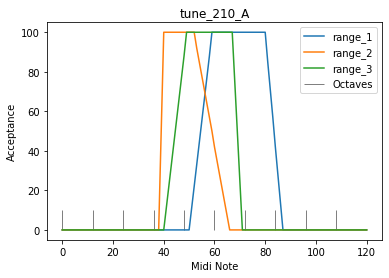

2.10 Improving chord notation, End note
=======================================

.. code:: python3

    from pyknon.genmidi import Midi
    from pyknon.music import Rest, Note, NoteSeq
    from music_generation import *
    import numpy as np
    import matplotlib.pyplot as plt

.. code:: python3

    #   pattern_gen takes the chord pattern (scales): it reapeats the pattern as long the melody is, and generates the beat number where the chords change. 
    # it also adds the end pattern
    def pattern_gen(scales,end_scale, melody_len):
        bpb = 4  # beats per bar
        
    #--Add note to chord
        scales = note_to_chord(scales)
        end_scale = note_to_chord(end_scale)
        
    #--scales  
        factor = int(np.trunc(melody_len/(np.sum(scales[:,0]) * bpb)) + 1) # factor rounded up: how many times is the pattern used
        change_times = np.cumsum(np.tile(scales[:,0],factor)) * bpb        # create change time list with factor
        change_times = np.concatenate((np.asarray([0]),change_times))[:-1] # add 0 at beginig remove last element
        
        for i in range(len(scales)):          # send scales to scale_create
            scales[i,1] = scale_create(scales[i,1])
        pattern = np.tile(scales,(factor,1))   # tile the scales as long the melody is
        pattern[:,0] = change_times            #insert change_times into scales
        
    #--end_scales 
        end_times = melody_len - np.cumsum(( end_scale[:,0]*bpb )[::-1])[::-1]   # reversed cumsum subtracted of melody_len
        end_scale[:,0] = end_times              #insert end_times into en_scale
        for i in range(len(end_scale)):         # send end_scale to scale_create
            end_scale[i,1] = scale_create(end_scale[i,1])
    
    #--merge
        pattern = np.delete(pattern, np.argwhere(pattern[:,0] >= end_scale[0,0]) ,0) # remove unneeded scales
        pattern = np.concatenate((pattern,end_scale),axis=0)
        pattern = np.delete(pattern, np.argwhere(pattern[:,0] >= melody_len) ,0)     # remove if end is 0 bars
        return pattern

Dictionary
----------

.. code:: python3

    C     = np.array([ 0, 4, 7])
    Cm    = np.array([ 0, 3, 7])
    Cdim  = np.array([ 0, 3, 6])
    
    CM7   = np.array([ 0, 4, 7, 11])
    C7    = np.array([ 0, 4, 7, 10])
    Cm7   = np.array([ 0, 3, 7, 10])
    Cdim7 = np.array([ 0, 3, 6, 10])
    Cdim6 = np.array([ 0, 3, 6, 9 ])
    C6    = np.array([ 0, 4, 7, 9 ]) # inversion of Am7
    Cm6   = np.array([ 0, 3, 7, 9 ]) 
    
    P = np.array([ 0,7])  # Power chord (Perfect unison, Perfect fifth)
    B = np.array([ 0])    # Bass (Perfect unison)
    
    major = np.array([ 0, 2, 4, 5, 7, 9, 11])
    minor = np.array([ 0, 2, 3, 5, 7, 8, 10])  
    blues = np.array([ 0, 3, 5, 6, 7, 10])

.. code:: python3

    def note_to_chord(input_s):
        
        tone_dic = {           'C' : 0 , 'C#' : 1 , 
                    'Db' : 1 , 'D' : 2 , 'D#' : 3 ,
                    'Eb' : 3 , 'E' : 4 , 'E#' : 5 ,
                    'Fb' : 4 , 'F' : 5 , 'F#' : 6 ,
                    'Gb' : 6 , 'G' : 7 , 'G#' : 8 ,
                    'Ab' : 8 , 'A' : 9 , 'A#' :10 ,
                    'Bb' : 10, 'B' :11 , 'B#' :12 ,
                    'Cb' : 11                      }
        
        input_s =np.asarray(input_s)
        le = len(input_s)
        out_s = [[0,1]]*le
        
        for sps in range(le):
            note = input_s[sps,1]
            nr = tone_dic[note]
            out_s[sps]= [input_s[sps,0]  ,   input_s[sps,2] + nr]
            
        out_s = np.asarray(out_s)
        return out_s

End note duration
~~~~~~~~~~~~~~~~~

It sounds better when the last note is played longer. With **end\_note**
all note duration cand be set on a specific value. End not duration is
not part of the melody\_len

.. code:: python3

    def ran_duration(duration, prob_duration, melody_len, end_dur):    
        duration= np.asarray(duration)                  # this are the allowed durations of the notes
        prob_duration = np.asarray(prob_duration)       # this are the probabilities how often each will occure
        prob_duration = prob_duration/np.sum(prob_duration)
        cumsum, melody_len, rythem = 0, melody_len/4 , np.asarray([])  #melody_len/4 as note values are quarter
        while cumsum < melody_len:
            note_len = np.random.choice(duration, p=prob_duration)
            cumsum = cumsum + note_len
            rythem = np.append(rythem,note_len)
        if end_dur != 0:  
            rythem = np.append(rythem,end_dur)
        return rythem , len(rythem)

tune\_2.10
----------

-  Better understandable Chord notation
-  longer end note duration
-  Equal to tune\_2.09\_D

-  Chords: Cm Cm7/Bb Eb Ab7 G7 \| C C/E F F#dim Ab7 G7 Cm
-  Three guitars playing chords
-  an accustic bass
-  Organ for the base with seprat bass pattern. Mostly the root note.
-  Vibraphone as solo voice

.. code:: python3

    def tune_210_A():
        tune_name = 'tune_210_A'  
        np.random.seed(144    )    #  79 33
        bar, bpb = 17, 4  # bar: Takt , bpb: beat per bar
        melody_len = bar * bpb
        end_dur = 1
        
     # | Cm Cm7/Bb Eb Ab7 G7 | C C/E F F#dim Ab7 G7 Cm |
        scales =[[1,'C',Cm],[1,'C',Cm7],[1,'Eb',C],[1,'Ab',C7],[1,'G',C7],[1,'C',C],[1,'C',C],[1,'F#',Cdim],[1,'Ab',C7],[1,'G',C7],[1,'C',Cm]] 
        bass1 =  [[1,'C',B],[1,'Bb',B], [1,'Eb',B],[1,'Ab',B], [1,'G',B], [1,'C',B],[1,'E',B],[1,'F#',B],   [1,'Ab',B], [1,'G',B], [1,'C',B]] 
        end_scale = [[0.5,'C',Cm],[0.5,'C',P]]
        
        pattern = pattern_gen(scales, end_scale, melody_len)
        bass1 = pattern_gen(bass1, end_scale, melody_len)
        
        
        # Solo voice
        range_1 = liniar_range(50,60,80,88)
        rythem1, notenr_1 = ran_duration([1/16,1/8, 1/4,1/2], [2,5,3,0.5], melody_len,end_dur)
        melody1 = acceptance_melody([-2,-1, 0, 1, 2],[1, 3, 1, 3, 1],pattern, 70, range_1, notenr_1, rythem1)
        volumes1 = ran_volume([0,127], [1,4], notenr_1 )
        notes1 = NoteSeq( [Note(no,octave=0, dur=du, volume=vo) for no,du,vo in zip(melody1,rythem1,volumes1)] )
        
        # Bass1  Accustic
        range_2 = liniar_range(38,41,52,67)
        rythem2, notenr_2 = ran_duration([1/8, 1/4,1/2], [4,4,1], melody_len,end_dur)
        melody2 = acceptance_melody([-2,-1, 0, 1, 2],[0, 3, 1, 3, 0],pattern, 50, range_2, notenr_2,rythem2)
        volumes2 = ran_volume([0,60], [0,8], notenr_2 )
        notes2 = NoteSeq( [Note(no,octave=0, dur=du, volume=vo) for no,du,vo in zip(melody2,rythem2,volumes2)] )
        
        # Bass2  Organ
        range_6 = liniar_range(30,38,50,62)
        rythem6, notenr_6 = ran_duration([1/8, 1/4,1/2], [0,1,1], melody_len,end_dur)
        melody6 = acceptance_melody([-2,-1, 0, 1, 2],[1, 1, 1, 1, 1],bass1, 48, range_6, notenr_6,rythem6)
        volumes6 = ran_volume([0,110], [0,8], notenr_6 )
        notes6 = NoteSeq( [Note(no,octave=0, dur=du, volume=vo) for no,du,vo in zip(melody6,rythem6,volumes6)] )
        
        # Chord Voices
        range_3 = liniar_range(40,50,67,72)
        rythem3, notenr_3 = ran_duration([1/8, 1/4,1/2], [1,2,1], melody_len,end_dur)
        melody3 = acceptance_melody([-2,-1, 0, 1, 2],[0, 3, 1, 3, 0],pattern, 65, range_3, notenr_3,rythem3)
        volumes3 = ran_volume([0,80], [0,8], notenr_3 )
        notes3 = NoteSeq( [Note(no,octave=0, dur=du, volume=vo) for no,du,vo in zip(melody3,rythem3,volumes3)] )
        
        range_4 = liniar_range(40,50,67,72)
        rythem4, notenr_4 = ran_duration([1/8, 1/4,1/2], [1,2,1], melody_len,end_dur)
        melody4 = acceptance_melody([-2,-1, 0, 1, 2],[0, 3, 1, 3, 0],pattern, 60, range_4, notenr_4,rythem4)
        volumes4 = ran_volume([0,90], [0,8], notenr_4 )
        notes4 = NoteSeq( [Note(no,octave=0, dur=du, volume=vo) for no,du,vo in zip(melody4,rythem4,volumes4)] )
        
        range_5 = liniar_range(40,50,67,72)
        rythem5, notenr_5 = ran_duration([1/8, 1/4,1/2], [1,2,1], melody_len,end_dur)
        melody5 = acceptance_melody([-2,-1, 0, 1, 2],[0, 3, 1, 3, 0],pattern, 54, range_5, notenr_5,rythem5)
        volumes5 = ran_volume([0,90], [0,8], notenr_5 )
        notes5= NoteSeq( [Note(no,octave=0, dur=du, volume=vo) for no,du,vo in zip(melody5,rythem5,volumes5)] )
        
        
        plot_range([range_1,range_2,range_3],['range_1','range_2','range_3'],tune_name)
        instruments = [11,32,24,24,24,16]
        notes = [notes1,notes2,notes3,notes4,notes5,notes6]
        return notes, instruments,tune_name

.. raw:: html

     <audio controls="controls" src="https://raw.githubusercontent.com/schuhva/Music-Generation/master/doc/releases/2.10/tune_209_D.flac" type="audio/flac"></audio>
     tune__209_D
     
      
     tune_209_D    

**Instruments:** Available are at lest the 128 General-Midi (GM)
Instruments. Depending on the sound-fonts there is a bigger choise. A
list of the GM instruments can be found here.
https://jazz-soft.net/demo/GeneralMidi.html

.. code:: python3

    
    def gen_midi():
    #     squezze into a MIDI framework
        notes, instruments, tune_name = tune_210_A() #  <--- select a tune  <<--     <<<<<<<<<--- select a tune -----
        nTracks = len(notes)
        
        m = Midi(number_tracks=nTracks, tempo=120, instrument=instruments)
        for iTrack in range(nTracks):
            m.seq_notes(notes[iTrack], track=iTrack)
    
        #--- write the MIDI file -----
        midi_file_name = tune_name +'.mid'   # set the name of the file
        m.write(midi_file_name)
        return midi_file_name

.. code:: python3

    ######---  Main  ---######
    midi_file_name = gen_midi()
    
    midi_play(midi_file_name)
    midi_audio(midi_file_name)
    midi_png(midi_file_name)

External **Music\_Generation** library
--------------------------------------

This library changes from version to version. New or changed code is
first explaind above. This is a copy of music\_generation.py

.. literalinclude:: music_generation.py
   :language: python
