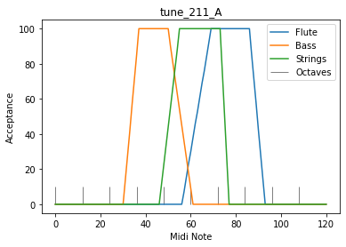

2.11 J. S. Bach C-Dur Prelude
=============================

In this Example I'm using the Chord of the C-Dur Prelude, BWV 846

.. code:: python3

    from pyknon.genmidi import Midi
    from pyknon.music import Rest, Note, NoteSeq
    from music_generation import *
    import numpy as np
    import matplotlib.pyplot as plt

Chord definitions
~~~~~~~~~~~~~~~~~

.. code:: python3

    C     = np.array([ 0, 4, 7])
    Cm    = np.array([ 0, 3, 7])
    Cdim  = np.array([ 0, 3, 6])
    
    CM7   = np.array([ 0, 4, 7, 11])
    C7    = np.array([ 0, 4, 7, 10])
    Cm7   = np.array([ 0, 3, 7, 10])
    Cdim7 = np.array([ 0, 3, 6, 10])
    Cdim6 = np.array([ 0, 3, 6, 9 ])
    C6    = np.array([ 0, 4, 7, 9 ]) # inversion of Am7
    Cm6   = np.array([ 0, 3, 7, 9 ])
    
    Csus4 = np.array([ 0, 5, 7])
    Csus2 = np.array([ 0, 2, 7])
    Csus47= np.array([ 0, 5, 7, 10])
    
    P = np.array([ 0,7])  # Power chord (Perfect unison, Perfect fifth)
    B = np.array([ 0])    # Bass (Perfect unison)
    
    major = np.array([ 0, 2, 4, 5, 7, 9, 11])
    minor = np.array([ 0, 2, 3, 5, 7, 8, 10])  
    blues = np.array([ 0, 3, 5, 6, 7, 10])

tune\_211\_A
------------

For this tune I use the chord sequence of a famous classical piece. **J.
S. Bach C-Dur Prelude, Wohltemperirtes Klavier, BWV 846**

-  Three Strings playing chords
-  an acoustic bass
-  Organ for the second base
-  A Flute as solo voice

.. code:: python3

    def tune_211_A():
        tune_name = 'tune_211_A'  
        np.random.seed(54    )    #  79 33
        bar, bpb = 36, 4  # bar: Takt , bpb: beat per bar
        melody_len = bar * bpb
        end_dur = 1.5
        
        scales = [[1,'C',C],[1,'D',Cm7],[1,'G',C7],[1,'C',C],[1,'A',Cm],[1,'D',C7],[1,'G',C],[1,'C',CM7],[1,'C',C6],[1,'D',C7],
                  [1,'G',C],[1,'G',Cdim6],[1,'D',Cm],[1,'F',Cdim6],[1,'C',C],[1,'F',CM7],[1,'F',C6],[1,'G',C7],
                  [1,'C',C],[1,'C',C7],[1,'F',CM7],[1,'F#',Cdim6],[1,'G#',Cdim6],[1,'G',C7],
                  [1,'C',C],[1,'G',Csus47],[1,'G',C7],[1,'F#',Cdim6],[1,'C',C],[1,'G',Csus47],[1,'G',C7],[1,'C',C7],[1,'F',C],[1,'G',C],[1,'C',C]]
        
        #end_scale = [[0.5,'C',Cm],[0.5,'C',P]]
        end_scale = [[1,'C',P]]
        pattern = pattern_gen(scales, end_scale, melody_len)
        #bass1 = pattern_gen(bass1, end_scale, melody_len)
        
        
        # Solo voice
        range_1 = liniar_range(56,70,86,94)
        rythem1, notenr_1 = ran_duration([1/16,1/8, 1/4,1/2], [0,3,3,0.5], melody_len,end_dur)
        melody1 = acceptance_melody([-2,-1, 0, 1, 2],[1, 5, 1, 5, 1],pattern, 76, range_1, notenr_1, rythem1)
        volumes1 = ran_volume([0,100], [1,6], notenr_1 )
        notes1 = NoteSeq( [Note(no,octave=0, dur=du, volume=vo) for no,du,vo in zip(melody1,rythem1,volumes1)] )
        
        # Bass1  Accustic
        range_2 = liniar_range(30,38,50,62)
        rythem2, notenr_2 = ran_duration([1/8, 1/4,1/2], [4,3,0], melody_len,end_dur)
        melody2 = acceptance_melody([-2,-1, 0, 1, 2],[0, 3, 1, 3, 0],pattern, 50, range_2, notenr_2,rythem2)
        volumes2 = ran_volume([0,100], [0,8], notenr_2 )
        notes2 = NoteSeq( [Note(no,octave=0, dur=du, volume=vo) for no,du,vo in zip(melody2,rythem2,volumes2)] )
        
        # Bass2  Organ
        range_6 = liniar_range(30,38,50,62)
        rythem6, notenr_6 = ran_duration([1/8, 1/4,1/2], [0,1,1], melody_len,end_dur)
        melody6 = acceptance_melody([-2,-1, 0, 1, 2],[1, 1, 1, 1, 1],pattern, 48, range_6, notenr_6,rythem6)
        volumes6 = ran_volume([0,120], [0,8], notenr_6 )
        notes6 = NoteSeq( [Note(no,octave=0, dur=du, volume=vo) for no,du,vo in zip(melody6,rythem6,volumes6)] )
        
        # Chord Voices
        range_3 = liniar_range(46,56,73,78)
        rythem3, notenr_3 = ran_duration([1/8, 1/4,1/2], [1,3,1], melody_len,end_dur)
        melody3 = acceptance_melody([-2,-1, 0, 1, 2],[0, 3, 1, 3, 0],pattern, 71, range_3, notenr_3,rythem3)
        volumes3 = ran_volume([0,100], [0,8], notenr_3 )
        notes3 = NoteSeq( [Note(no,octave=0, dur=du, volume=vo) for no,du,vo in zip(melody3,rythem3,volumes3)] )
        
        range_4 = liniar_range(46,56,73,78)
        rythem4, notenr_4 = ran_duration([1/8, 1/4,1/2], [1,3,1], melody_len,end_dur)
        melody4 = acceptance_melody([-2,-1, 0, 1, 2],[0, 3, 1, 3, 0],pattern, 66, range_4, notenr_4,rythem4)
        volumes4 = ran_volume([0,100], [0,8], notenr_4 )
        notes4 = NoteSeq( [Note(no,octave=0, dur=du, volume=vo) for no,du,vo in zip(melody4,rythem4,volumes4)] )
        
        range_5 = liniar_range(46,56,73,78)
        rythem5, notenr_5 = ran_duration([1/8, 1/4,1/2], [1,3,1], melody_len,end_dur)
        melody5 = acceptance_melody([-2,-1, 0, 1, 2],[0, 3, 1, 3, 0],pattern, 60, range_5, notenr_5,rythem5)
        volumes5 = ran_volume([0,100], [0,8], notenr_5 )
        notes5= NoteSeq( [Note(no,octave=0, dur=du, volume=vo) for no,du,vo in zip(melody5,rythem5,volumes5)] )
        
        
        plot_range([range_1,range_2,range_3],['Flute','Bass','Strings'],tune_name)
        instruments = [71,43,49,49,49,16]
        notes = [notes1,notes2,notes3,notes4,notes5,notes6]
        return notes, instruments,tune_name

.. raw:: html

     <audio controls="controls" src="https://raw.githubusercontent.com/schuhva/Music-Generation/master/doc/releases/2.11/tune_211_A.flac" type="audio/flac"></audio>
     tune__211_A
     
      
     tune_211_A    

**Instruments:** Available are at lest the 128 General-Midi (GM)
Instruments. Depending on the sound-fonts there is a bigger choice. A
list of the GM instruments can be found here.
https://jazz-soft.net/demo/GeneralMidi.html

.. code:: python3

    
    def gen_midi():
    #     squezze into a MIDI framework
        notes, instruments, tune_name = tune_211_A() #  <--- select a tune  <<--     <<<<<<<<<--- select a tune -----
        nTracks = len(notes)
        
        m = Midi(number_tracks=nTracks, tempo=120, instrument=instruments)
        for iTrack in range(nTracks):
            m.seq_notes(notes[iTrack], track=iTrack)
    
        #--- write the MIDI file -----
        midi_file_name = tune_name +'.mid'   # set the name of the file
        m.write(midi_file_name)
        return midi_file_name

.. code:: python3

    ######---  Main  ---######
    midi_file_name = gen_midi()
    
    midi_play(midi_file_name)
    midi_audio(midi_file_name)
    midi_png(midi_file_name)

External **Music\_Generation** library
--------------------------------------

This library changes from version to version. New or changed code is
first explained above. This is a copy of music\_generation.py

.. literalinclude:: music_generation.py
   :language: python
