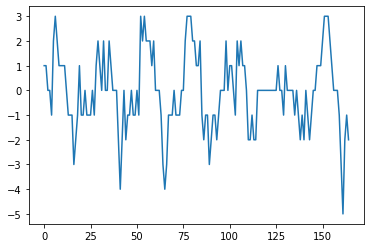

3.02 First meteorological data
==============================

-  Starting with just implementing one voice. The meteorological data is
   first transformed before the differences are taken and so created the
   intervals.
-  Functions which are no longer part of this development step are
   **exported to the music\_generation.py file.** The file is found at
   the **end** of the page.

.. code:: python3

    from pyknon.genmidi import Midi
    from pyknon.music import Rest, Note, NoteSeq
    import music_generation
    import numpy as np
    import pandas as pd
    import matplotlib.pyplot as plt
    import matplotlib.ticker as plticker
    from datetime import date

Transform meteorological data
-----------------------------

.. code:: python3

    def scale(a):    return (a-a.min())/(a.max()-a.min())
    h24 = 6*24
    h72 = 3*h24
    
    def read_meteo_data(fName):
        colNames = ['Stao','time', 'Flash', 'p_QNH', 'T_2m', 'Precip', 'H_rel', 'V_wind']  
        df = pd.read_csv(fName,sep=';', skiprows=3, names=colNames, na_values='-')
        print(df.head())
        return df
    
    fPath = '/mnt/daten/04_Schule/42_Kanti/Matrua/Music_generation/Organisation/MeteoSchweiz/Daten/'
    fName = 'order_74678_data.txt'
    dM = read_meteo_data(fPath+fName)
    
    #---- Parameter bestimmen -----------
    NT, MP = dM.shape
    print('-----------------')
    print('NT, MP', NT, MP)
    

.. parsed-literal::

      Stao          time  Flash  p_QNH  T_2m  Precip  H_rel  V_wind
    0  KLO  201908280000      0  968.5  19.6     0.0   90.1     0.6
    1  KLO  201908280010      0  968.5  19.3     0.0   93.0     0.6
    2  KLO  201908280020      0  968.6  19.4     0.0   90.6     0.7
    3  KLO  201908280030      0  968.7  19.6     0.0   90.3     0.7
    4  KLO  201908280040      0  968.7  18.7     0.0   95.6     0.5
    -----------------
    NT, MP 2016 8

meteorological data has **noise.** Also are the value difference in the
10 min measurement interval not that big.

**w defines the sampling rate**. But k also defines the size of the
moving average. With this method every value is used once.

As we want intervals, the difference is taken. But the intervals are
first multiplied with a factor to have a suitable range of intervals.

.. code:: python3

    k=4  #Column number
    w = 6 # how many values are used for the mean
    Yw  = np.array(dM[dM.columns[k]].rolling(window=w,center=True).mean()) 
    Yw= Yw[0:1000:w]
    trans = np.diff(Yw)[1:]
    trans = trans*1.3
    trans = np.round(trans)
    #trans = np.nancumsum(trans)
    trans = trans.astype(int)
    print(trans)
    #print(len(trans))
    
    plt.plot(trans)
    #t(trans,bins=50)

.. parsed-literal::

    [ 1  1  0  0 -1  2  3  2  1  1  1  1  0 -1 -1 -1 -3 -2 -1  1 -1 -1  0 -1
     -1 -1  0 -1  1  2  1  0  2  0  0  2  1  0  0  0 -2 -4 -2  0 -2 -1 -1  0
     -1 -1  0 -1  3  2  3  2  2  2  1  2  0  0  0 -1 -3 -4 -3 -1 -1 -1  0 -1
     -1 -1  0  0  2  3  3  3  2  2  1  1  2 -1 -2 -1 -1 -3 -2 -1 -1 -2 -1  0
      0  0  2  0  1  1  0 -1  2  1  2  1  1  0 -2 -2 -1 -2 -2  0  0  0  0  0
      0  0  0  0  0  0  1  0  0 -1  1  0  0  0  0 -1  0 -1 -2 -1 -2  0 -1 -2
     -1  0  0  1  1  1  2  3  3  3  2  1  0  0  0 -1 -3 -5 -2 -1 -2]

.. parsed-literal::

    [<matplotlib.lines.Line2D at 0x7efc246d1048>]

**Chords and scales**

.. code:: python3

    major = np.array([ 0, 2, 4, 5, 7, 9, 11])
    minor = np.array([ 0, 2, 3, 5, 7, 8, 10])  
    C7 = np.array([ 0, 4, 7, 10]) 
    CM7 = np.array([ 0, 4, 7, 11])
    Cm7 = np.array([ 0, 3, 7, 10])
    Cm  = np.array([ 0, 3, 7])
    C   = np.array([ 0, 4, 7])
    bass= np.array([ 0])

Tune T
------

The intervals of the meteorological data are scaled and played

.. code:: python3

    def meteo_melody(met_intvl, pattern, start_note, a_range, notenr, rythem):
        melody = np.zeros(notenr, dtype=int)
        cum_rythem = np.cumsum(rythem) *4
        cum_rythem = np.concatenate(([0],cum_rythem))[:-1] # add 0 at beginig remove last element
        scale_change = pattern[:,0]
        scale_nr =0
        scale = pattern[scale_nr,1]
        melody[0] = scale[i_last_note(start_note,scale)]
        cummelody = i_last_note(start_note,scale)+np.nancumsum(met_intvl)
        #print(cummelody)
        
        for npn in range(1, notenr):  #npn: note per note (index)      
            scale_nr = np.ravel(np.argwhere(scale_change <= cum_rythem[npn-1])) [-1]     
            scale = pattern[scale_nr,1]
            inote_next = cummelody[npn-1]
            #print(inote_next,scale)
            melody[npn] = scale[inote_next]
        #print(melody)
        return melody

.. code:: python3

    def tune_T():
        tune_name = 'tune_T'  
        #np.random.seed(23)
        bar, bpb = 12, 4  # bar: Takt , bpb: beat per bar
        melody_len = bar * bpb
    
    
        #scales = [[1,CM7],[1,Cm7+9],[1,Cm7+2],[1,C7+7]] #rythem Change
        #scales = [[4,C7],[2,C7+5],[2,C7],[1,C7+7],[1,C7+5],[2,C7]] # Blues  
        scales = [[8,major]]
        pattern = pattern_gen(scales, melody_len)
        
        range_1 = liniar_range(44,51,70,76)
        rythem1, notenr_1 = ran_duration([1/8, 1/4,1/2], [1,3,1], melody_len)
        melody1 = meteo_melody(trans,pattern, 60, range_1, notenr_1, rythem1)
        volumes1 = ran_volume([0,120], [1,8], notenr_1 )
        notes1 = NoteSeq( [Note(no,octave=0, dur=du, volume=vo) for no,du,vo in zip(melody1,rythem1,volumes1)] )
           
        
        #plot_range([range_1],['range_1'],tune_name)
        instruments = [51]
        notes = [notes1]
        return notes, instruments,tune_name

.. raw:: html

     <audio controls="controls" src="https://raw.githubusercontent.com/schuhva/Music-Generation/master/doc/releases/3.01/tune_T.flac" type="audio/flac"></audio>
     tune_T  
     
      
     tune_T     

**Instruments:** Available are at lest the 128 General-Midi (GM)
Instruments. Depending on the sound-fonts there is a bigger choice. A
list of the GM instruments can be found here.
https://jazz-soft.net/demo/GeneralMidi.html

Generate Midi and Audio file
----------------------------

.. code:: python3

    def gen_midi():
    #     squezze into a MIDI framework
        notes, instruments, tune_name = tune_T() #  <--- select a tune  <<--     <<<<<<<<<--- select a tune -----
        nTracks = len(notes)
        
        m = Midi(number_tracks=nTracks, tempo=120, instrument=instruments)
        for iTrack in range(nTracks):
            m.seq_notes(notes[iTrack], track=iTrack)
    
        #--- write the MIDI file -----
        midi_file_name = tune_name +'.mid'   # set the name of the file
        m.write(midi_file_name)
        return midi_file_name

.. code:: python3

    ######---  Main  ---######
    midi_file_name = gen_midi()
    
    midi_play(midi_file_name)
    midi_audio(midi_file_name)
    midi_png(midi_file_name)

External **Music\_Generation** library
--------------------------------------

This library changes from version to version. New or changed code is
first explained above. This is a copy of music\_generation.py

.. literalinclude:: music_generation.py
   :language: python
