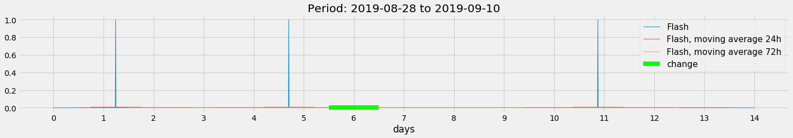
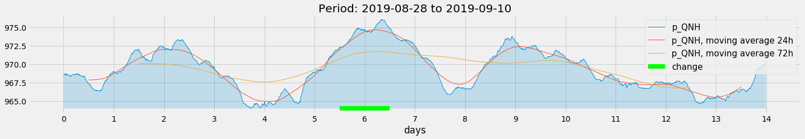
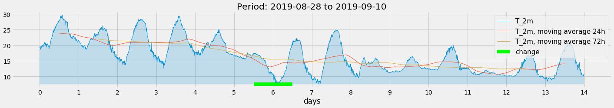
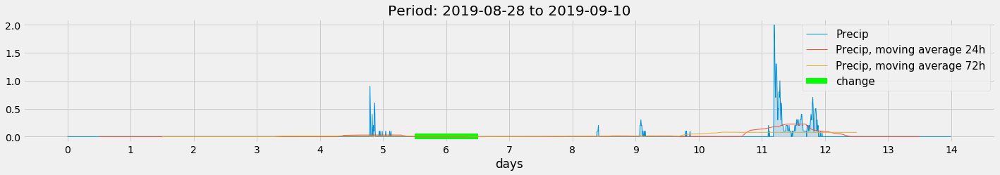
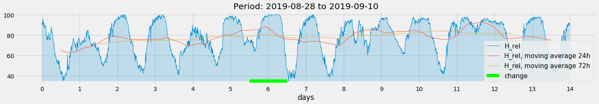
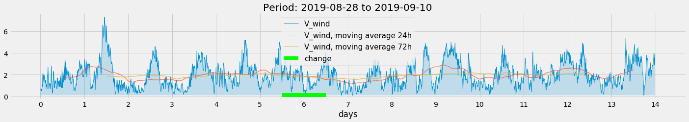

3.01.1 Display Meteo-Data
=========================

Station: Kloten/Zürich Flughafen

Legende:

::

    stn; time; brefarz0; prestas0; tre200s0; rre150z0; ure200s0; fkl010z0

    brefarz0  No                                   Fernblitze (Entfernung 3 - 30 km); Zehnminutensumme
    prestas0  hPa                                  Luftdruck auf Stationshöhe (QFE); Momentanwert
    tre200s0  °C                                   Lufttemperatur 2 m über Boden; Momentanwert
    rre150z0  mm                                   Niederschlag; Zehnminutensumme
    ure200s0  %                                    Relative Luftfeuchtigkeit 2 m über Boden; Momentanwert
    fkl010z0  m/s                                  Windgeschwindigkeit skalar; Zehnminutenmittel

.. code:: python3

    import numpy as np
    import pandas as pd
    import matplotlib.pyplot as plt
    import matplotlib.ticker as plticker
    from datetime import date
    
    def scale(a):    return (a-a.min())/(a.max()-a.min())

Read Meteo-Data
---------------

.. code:: python3

    def read_meteo_data(fName):
        colNames = ['Stao','time', 'Flash', 'p_QNH', 'T_2m', 'Precip', 'H_rel', 'V_wind']  
        df = pd.read_csv(fName,sep=';', skiprows=3, names=colNames, na_values='-')
        print(df.head())
        return df
    
    fPath = '/mnt/daten/04_Schule/42_Kanti/Matrua/Music_generation/Organisation/MeteoSchweiz/Daten/'
    fName = 'order_74678_data.txt'
    dM = read_meteo_data(fPath+fName)
    
    #---- Parameter bestimmen -----------
    NT, MP = dM.shape
    print('-----------------')
    print('NT, MP', NT, MP)

.. parsed-literal::

      Stao          time  Flash  p_QNH  T_2m  Precip  H_rel  V_wind
    0  KLO  201908280000      0  968.5  19.6     0.0   90.1     0.6
    1  KLO  201908280010      0  968.5  19.3     0.0   93.0     0.6
    2  KLO  201908280020      0  968.6  19.4     0.0   90.6     0.7
    3  KLO  201908280030      0  968.7  19.6     0.0   90.3     0.7
    4  KLO  201908280040      0  968.7  18.7     0.0   95.6     0.5
    -----------------
    NT, MP 2016 8

Parse begin and end date
------------------------

.. code:: python3

    def parse_date(A):
        yr = int(str(A)[0:4])
        mo = int(str(A)[4:6])
        dy = int(str(A)[6:8])
        hr = int(str(A)[8:10])
        mi = int(str(A)[10:12])
        return date(yr,mo,dy)
        
    firstDateM = dM['time'].iloc[0]
    lastDateM = dM['time'].iloc[-1]
    
    firstDate = parse_date(firstDateM); print('firstDate', firstDate)
    lastDate = parse_date(lastDateM);   print('lastDate',  lastDate)

.. parsed-literal::

    firstDate 2019-08-28
    lastDate 2019-09-10

Plot data
---------

.. code:: python3

    #---- Parameter festlegen ----------
    h24 = 6*24
    h72 = 3*h24
    tt = np.arange(NT)/h24  # Zeitachse in Tagen
    
    #---- graphics ---------------------
    with plt.style.context('fivethirtyeight'): 
        for k in range(2,MP,1):
            fig = plt.figure(figsize=(22,3)) 
            ax = fig.add_subplot(111)
            
            Y = np.array(dM[dM.columns[k]])
            Y24 = np.array(dM[dM.columns[k]].rolling(window=h24,center=True).mean())
            Y72 = np.array(dM[dM.columns[k]].rolling(window=h72,center=True).mean())
            
            plt.plot(tt,Y,linewidth=1.0, label=dM.columns[k])
            plt.fill_between(tt,Y,Y.min(),alpha=0.2)
            plt.plot(tt,Y24,linewidth=1.0, label=dM.columns[k]+', moving average 24h')
            plt.plot(tt,Y72,linewidth=1.0, label=dM.columns[k]+', moving average 72h')
            
            plt.hlines(Y.min(),5.5, 6.5, colors='lime', linewidth=8, linestyles='solid', label='change')
            
            loc = plticker.MultipleLocator(base=1.0) # this locator puts ticks at regular intervals
            ax.xaxis.set_major_locator(loc)
            plt.title('Period: '+str(firstDate)+' to '+str(lastDate))
            plt.xlabel('days')
            plt.legend(prop={'size':15})
            plt.show()

.. code:: python3

    for k in range(2,MP,1):
        print(k, dM.columns[k])

.. parsed-literal::

    2 Flash
    3 p_QNH
    4 T_2m
    5 Precip
    6 H_rel
    7 V_wind

