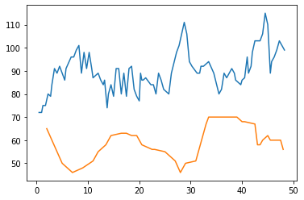

3.02 Sync voices
================

-  The voices are now synchronized
-  Each voice has an own rolling mean window and scale factor
-  Functions which are no longer part of this development step are
   **exported to the music\_generation.py file.** The file is found at
   the **end** of the page.

.. code:: python3

    from pyknon.genmidi import Midi
    from pyknon.music import Rest, Note, NoteSeq
    from music_generation import *
    import numpy as np
    import pandas as pd
    import matplotlib.pyplot as plt
    import matplotlib.ticker as plticker
    from datetime import date

Transform Meteo data
--------------------

.. code:: python3

    def scale(a):    return (a-a.min())/(a.max()-a.min())
    
    def read_meteo_data(fName):
        colNames = ['Stao','time', 'Flash', 'p_QNH', 'T_2m', 'Precip', 'H_rel', 'V_wind']  
        df = pd.read_csv(fName,sep=';', skiprows=3, names=colNames, na_values='-')
        print(df.head())
        return df
    
    fPath = '/mnt/daten/04_Schule/42_Kanti/Matrua/Music_generation/Organisation/MeteoSchweiz/Daten/'
    fName = 'order_74678_data.txt'
    dM = read_meteo_data(fPath+fName)
    
    #---- Parameter bestimmen -----------
    NT, MP = dM.shape
    print('-----------------')
    print('NT, MP', NT, MP)
    

.. parsed-literal::

      Stao          time  Flash  p_QNH  T_2m  Precip  H_rel  V_wind
    0  KLO  201908280000      0  968.5  19.6     0.0   90.1     0.6
    1  KLO  201908280010      0  968.5  19.3     0.0   93.0     0.6
    2  KLO  201908280020      0  968.6  19.4     0.0   90.6     0.7
    3  KLO  201908280030      0  968.7  19.6     0.0   90.3     0.7
    4  KLO  201908280040      0  968.7  18.7     0.0   95.6     0.5
    -----------------
    NT, MP 2016 8

**met\_transform**

-  the **rolling mean** is to remove noise on the data.
-  the **factors** are used to scale the melody, such that it plays in a
   certain range
-  **start** defines the staring point of the melodies by removing the
   begin of the data

.. code:: python3

    def met_transform(dM,factors,means,start):
        col_nr = dM.shape[1]-2
        start = int(start*6)
        cut_border = np.trunc((np.amax(means))/2).astype(int)   # calculate nr of nan at the border because of the rolling mean
        cut_begin = np.amax([cut_border,start])
        trans = np.zeros((col_nr, (dM.shape[0]  -cut_border -cut_begin))) 
        if col_nr != len(factors) or col_nr != len(means): print('dM,factor,mean not same length')
        
        for nr,factor, mean in zip(range(col_nr),factors,means):                                          
            Yw  = np.array(dM[dM.columns[nr +2]].rolling(window=mean,center=True).mean()) # nr+2 the first two colums are location and date.
            Yw = Yw * factor
            trans[nr] = Yw[cut_begin: -cut_border]  # remove nan at begining and end. because of rolling mean
            
        return trans

**Chords and scales**

.. code:: python3

    major = np.array([ 0, 2, 4, 5, 7, 9, 11])
    minor = np.array([ 0, 2, 3, 5, 7, 8, 10])  
    C7 = np.array([ 0, 4, 7, 10]) 
    CM7 = np.array([ 0, 4, 7, 11])
    Cm7 = np.array([ 0, 3, 7, 10])
    Cm  = np.array([ 0, 3, 7])
    C   = np.array([ 0, 4, 7])
    bass= np.array([ 0])

Tune U
------

This tune uses the wind and temperature data, starting after 80 hours
--> 30.8.2019

.. code:: python3

    def meteo_melody(meteo, pattern, start_note, a_range, notenr, rythem,mpb):
        melody = np.zeros(notenr, dtype=int)
        cum_rythem = np.cumsum(rythem) *4             
        cum_rythem = np.concatenate(([0],cum_rythem)) # add 0 at beginig 
        
        scale_change = pattern[:,0]
        scale_nr =0
        scale = pattern[scale_nr,1]
        melody[0] = scale[i_last_note(start_note,scale)]
        
        for npn in range(1, notenr):  #npn: note per note (index)      
            
            scale_nr = np.ravel(np.argwhere(scale_change <= cum_rythem[npn-1])) [-1]     
            scale = pattern[scale_nr,1]
            
            # find interval
            met_resolution = 10
            inter = np.asarray([cum_rythem[npn-1], cum_rythem[npn]])  # get beat_nr's 
            inter = np.round((inter*mpb)/met_resolution).astype(int)  # calulate index of the data array
            intvl = meteo[inter[1]] - meteo[inter[0]]                 # take the diffrence of the data
            intvl = np.round(intvl).astype(int)                       # round to an int
            
            inote_befor = i_last_note(melody[npn-1],scale)    # get i in the scale of the last note
            inote = inote_befor + intvl                       # calculate i in scale of note    
            melody[npn] = scale[inote]                        # set in to melody
             
        #print(melody)
        plt.plot(cum_rythem[1:],melody) ; plt.xlabel= ('beat nr.'); plt.ylabel=('midi note nr')
        return melody

.. code:: python3

    def tune_U():
        tune_name = 'tune_U'  
        #np.random.seed(23)
        bar, bpb = 12, 4  # bar: Takt , bpb: beat per bar
        melody_len = bar * bpb
        mpb = 70   #minutes per beat.
        start = 79.5      # start in hours 
        
        trans = met_transform(dM,[1,2.5,0.8,1,0.3,4.5],[6,6,6,6,6,2],start)
        #plt.plot(trans[5,:300])
        #np.set_printoptions(threshold=np.inf)
        #print(trans[1,::20])
        
        
        scales = [[1,CM7],[1,Cm7+9],[1,Cm7+2],[1,C7+7]] #rythem Change
        #scales = [[4,C7],[2,C7+5],[2,C7],[1,C7+7],[1,C7+5],[2,C7]] # Blues  
        scales = [[8,minor]]
        pattern = pattern_gen(scales, melody_len)
        
        range_1 = liniar_range(44,51,70,76)
        rythem1, notenr_1 = ran_duration([1/16,1/8, 1/4,1/2], [2,4,1,0], melody_len)
        melody1 = meteo_melody(trans[5],pattern, 72, range_1, notenr_1, rythem1,mpb)
        volumes1 = ran_volume([0,120], [1,8], notenr_1 )
        notes1 = NoteSeq( [Note(no,octave=0, dur=du, volume=vo) for no,du,vo in zip(melody1,rythem1,volumes1)] )
        
        range_2 = liniar_range(44,51,70,76)
        rythem2, notenr_2 = ran_duration([1/16,1/8, 1/4,1/2], [0,2,3,2], melody_len)
        melody2 = meteo_melody(trans[4],pattern, 65, range_2, notenr_2, rythem2,mpb)
        volumes2 = ran_volume([0,120], [1,8], notenr_2 )
        notes2 = NoteSeq( [Note(no,octave=0, dur=du, volume=vo) for no,du,vo in zip(melody2,rythem2,volumes2)] )
    
        
        #plot_range([range_1],['range_1'],tune_name)
        instruments = [10,49]
        notes = [notes1,notes2]
        return notes, instruments,tune_name

.. raw:: html

     <audio controls="controls" src="https://raw.githubusercontent.com/schuhva/Music-Generation/master/doc/releases/3.02/tune_U.flac" type="audio/flac"></audio>
     tune_U
     
      
     tune_U     
     

     <audio controls="controls" src="https://raw.githubusercontent.com/schuhva/Music-Generation/master/doc/releases/3.02/tune_U_2.flac" type="audio/flac"></audio>
     tune_U_2
     
      
     tune_U_2     

**Instruments:** Available are at lest the 128 General-Midi (GM)
Instruments. Depending on the sound-fonts there is a bigger choice. A
list of the GM instruments can be found here.
https://jazz-soft.net/demo/GeneralMidi.html

Generate Midi and Audio file
----------------------------

.. code:: python3

    def gen_midi():
    #     squezze into a MIDI framework
        notes, instruments, tune_name = tune_U() #  <--- select a tune  <<--     <<<<<<<<<--- select a tune -----
        nTracks = len(notes)
        
        m = Midi(number_tracks=nTracks, tempo=120, instrument=instruments)
        for iTrack in range(nTracks):
            m.seq_notes(notes[iTrack], track=iTrack)
    
        #--- write the MIDI file -----
        midi_file_name = tune_name +'.mid'   # set the name of the file
        m.write(midi_file_name)
        return midi_file_name

.. code:: python3

    ######---  Main  ---######
    midi_file_name = gen_midi()
    
    midi_play(midi_file_name)
    midi_audio(midi_file_name)
    midi_png(midi_file_name)

External **Music\_Generation** library
--------------------------------------

This library changes from version to version. New or changed code is
first explained above. This is a copy of music\_generation.py

.. literalinclude:: music_generation.py
   :language: python
