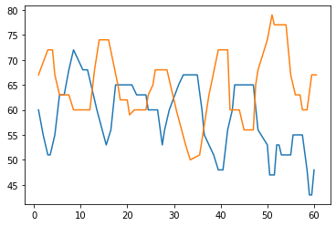

3.03 Chord pattern and Timpani
==============================

-  Using Chord pattern like in the versions 2.08 and 2.09
-  Adding a easy drum function controlled by the volume.
-  The range and the acceptance functions are not in use.

.. code:: python3

    from pyknon.genmidi import Midi
    from pyknon.music import Rest, Note, NoteSeq
    from music_generation import*
    import numpy as np
    import pandas as pd
    import matplotlib.pyplot as plt
    import matplotlib.ticker as plticker
    from datetime import date

Transform Meteorological data
-----------------------------

.. code:: python3

    def scale(a):    return (a-a.min())/(a.max()-a.min())
    
    def read_meteo_data(fName):
        colNames = ['Stao','time', 'T_Boden_20cm', 'V_Windböe', 'T_Chill', 'Flash_30km', 'Glob_rad', 'QFE','T_2m','Flash_3km','Rain_Sum','Rain_intens','H_rel','visibi','V_wind','stabw_V_wind','direction_wind']  
        df = pd.read_csv(fName,sep=';', skiprows=3, names=colNames, na_values='-')
        print(df.head())
        return df
    
    fPath = '/mnt/daten/04_Schule/42_Kanti/Matrua/Music_generation/Organisation/MeteoSchweiz/Daten/'
    fName = 'order_74947_data.txt'
    dM = read_meteo_data(fPath+fName)
    
    #---- Parameter bestimmen -----------
    NT, MP = dM.shape
    print('-----------------')
    print('NT, MP', NT, MP)
    

.. parsed-literal::

      Stao          time  T_Boden_20cm  V_Windböe  T_Chill  Flash_30km  Glob_rad  \
    0  KLO  201908270000          20.4        1.2     14.2           0         2   
    1  KLO  201908270010          20.4        0.9     14.4           0         2   
    2  KLO  201908270020          20.4        1.1     14.4           0         1   
    3  KLO  201908270030          20.4        0.8     13.8           0         2   
    4  KLO  201908270040          20.4        0.5     14.2           0         2   
    
         QFE  T_2m  Flash_3km  Rain_Sum  Rain_intens  H_rel  visibi  V_wind  \
    0  968.2  14.2          0       0.0          0.0   99.6  6626.0     0.7   
    1  968.2  14.4          0       0.0          0.0   98.5  1277.0     0.5   
    2  968.2  14.4          0       0.0          0.0   98.6  4900.0     0.5   
    3  968.3  13.8          0       0.0          0.0   99.0  7417.0     0.6   
    4  968.2  14.2          0       0.0          0.0   99.7   981.0     0.4   
    
       stabw_V_wind  direction_wind  
    0             9             110  
    1            40             198  
    2            28             333  
    3             4             326  
    4            30             256  
    -----------------
    NT, MP 2160 17

**Chords and scales**

.. code:: python3

    major = np.array([ 0, 2, 4, 5, 7, 9, 11])
    minor = np.array([ 0, 2, 3, 5, 7, 8, 10])  
    C7 = np.array([ 0, 4, 7, 10]) 
    CM7 = np.array([ 0, 4, 7, 11])
    Cm7 = np.array([ 0, 3, 7, 10])
    Cm  = np.array([ 0, 3, 7])
    Cdim   = np.array([ 0, 3, 6])
    C   = np.array([ 0, 4, 7])
    power= np.array([ 0, 7])
    B= np.array([ 0])

**met\_transform**

-  the **rolling mean** is to remove noise on the data.
-  the **factors** are used to scale the melody, such that it plays in a
   certain range
-  **start** defines the staring point of the melodies by removing the
   begin of the data

Tune\_W
-------

-  This tune uses the temperature and humidity
-  With bassoon and clarinet
-  Chord pattern Cm Ab Fm Ddim G7 Cm Fm G7

.. code:: python3

    def tune_W():
        tune_name = 'tune_W'  
        np.random.seed(39)  #56
        bar, bpb = 15, 4  # bar: Takt , bpb: beat per bar
        melody_len = bar * bpb
        mpb = 120   #minutes per beat.
        start =10     # start in hours 
        
        # met_transform: [Factor for each data serie] ,[numbers of value for the rolling mean]
        trans = met_transform(dM,[1,1,1,1,0.5,1,0.38,1,1,1,0.1,1,4.5,1,1,],[6,6,6,6,6,6,6,6,6,6,6,6,6,6,2],start)  
    
        scales = [[1,Cm],[1,C+8],[1,Cm+5],[1,Cdim+2],[1,C7+7],[1,Cm],[1,Cm+5],[1,C7+7]]
    
        end_scale = [[1,Cm],[1,power]]
        pattern = pattern_gen(scales, end_scale, melody_len)
    
        # humidity
        range_1 = liniar_range(0,0,0,0)  # not in use 
        rythem1, notenr_1 = ran_duration([1/16,1/8, 1/4,1/2], [0,2,3,1], melody_len)
        melody1 = meteo_melody(trans[10],pattern, 60, range_1, notenr_1, rythem1,mpb)
        volumes1 = ran_volume([0,120], [1,8], notenr_1 )
        notes1 = NoteSeq( [Note(no,octave=0, dur=du, volume=vo) for no,du,vo in zip(melody1,rythem1,volumes1)] )
        
        # temperature
        range_2 = liniar_range(0,0,0,0)
        rythem2, notenr_2 = ran_duration([1/16,1/8, 1/4,1/2], [0,2,3,2], melody_len)
        melody2 = meteo_melody(trans[6],pattern, 66, range_2, notenr_2, rythem2,mpb)
        volumes2 = ran_volume([0,120], [1,8], notenr_2 )
        notes2 = NoteSeq( [Note(no,octave=0, dur=du, volume=vo) for no,du,vo in zip(melody2,rythem2,volumes2)] )
    
        instruments = [70,71]
        notes = [notes1,notes2]
        return notes, instruments,tune_name

.. raw:: html

     <audio controls="controls" src="https://raw.githubusercontent.com/schuhva/Music-Generation/master/doc/releases/3.03/tune_W.flac" type="audio/flac"></audio>
     tune_W
     
      
     tune_W     

Tune\_X
-------

-  Major-scale
-  it is the rain of the 8.09.2019. See 3.03.1 Display meteorological
   data
-  Air-pressure and temperature as melody.
-  Air-pressure and temperature are during this rain sequence relatively
   constant. So the melody does often play the same note
-  The volume of the timpani is controlled by the amount of rain. The
   data is magnified by a large factor. The peaks are then cut of.
   Otherwise the drum would only be heard for a short moment.

Met\_percus
~~~~~~~~~~~

-  met\_percus is an function to create an easy drum
-  the played note can be a single note or an list of several notes
   which is repeated

.. code:: python3

    def met_percus(meteo, note,frequ,volume, melody_len, mpb):
    
        note_nr =  int(melody_len/(frequ*4))
        #print(melody_len,mpb,note_nr)
        rythem = np.repeat(frequ,note_nr)
        melody = np.repeat(note,note_nr/len(note))
        volume = np.zeros(note_nr, dtype=int)
        
        for npn in range(note_nr):  #npn: note per note (index)      
    
            met_resolution = 10
            beat_nr = npn*frequ*4                                   #find beat nr
            i_met = np.round((beat_nr*mpb)/met_resolution).astype(int)  # calulate index of the data array
            vol = meteo[i_met]             # take the diffrence of the data
            vol = np.round(vol).astype(int)                       # round to an int
            volume[npn]= vol
        volume = np.where(volume > 127, 127, volume)
    
        return  melody, rythem, volume

.. code:: python3

    def tune_X():
        tune_name = 'tune_X'  
        #np.random.seed(56)
        bar, bpb = 13, 4  # bar: Takt , bpb: beat per bar
        melody_len = bar * bpb
        mpb = 60   #minutes per beat.
        start =276     # start in hours 
    
        trans = met_transform(dM,[1,1,1,1,1,4,0.8,1,500,1,0.2,1,4.5,4,1,],[6,6,6,6,6,6,6,6,6,6,6,6,6,6,2],start)
    
        scales = [[8,major]]
        end_scale = [[3,power]]
        pattern = pattern_gen(scales, end_scale, melody_len)
    
        # Pressure
        range_1 = liniar_range(0,0,0,0)
        rythem1, notenr_1 = ran_duration([1/32,1/8, 1/4,1/2], [0,2,3,1], melody_len)
        melody1 = meteo_melody(trans[5],pattern, 60, range_1, notenr_1, rythem1,mpb)
        volumes1 = ran_volume([0,100], [1,8], notenr_1 )
        notes1 = NoteSeq( [Note(no,octave=0, dur=du, volume=vo) for no,du,vo in zip(melody1,rythem1,volumes1)] )
        
        # temp
        range_2 = liniar_range(0,0,0,0)
        rythem2, notenr_2 = ran_duration([1/16,1/8, 1/4,1/2], [0,2,3,2], melody_len)
        melody2 = meteo_melody(trans[6],pattern, 65, range_2, notenr_2, rythem2,mpb)
        volumes2 = ran_volume([0,100], [1,8], notenr_2 )
        notes2 = NoteSeq( [Note(no,octave=0, dur=du, volume=vo) for no,du,vo in zip(melody2,rythem2,volumes2)] )
        
        #timpani rain
        #  met_percus( meteo-data,   )
        melody3, rythem3, volumes3 = met_percus(trans[8], [72,73,74], 1/16, [30,120], melody_len, mpb)
        notes3 = NoteSeq( [Note(no,octave=0, dur=du, volume=vo) for no,du,vo in zip(melody3,rythem3,volumes3)] )
        
    
        instruments = [70,61,47]
        notes = [notes1,notes2,notes3]
        return notes, instruments,tune_name

.. raw:: html

     <audio controls="controls" src="https://raw.githubusercontent.com/schuhva/Music-Generation/master/doc/releases/3.03/tune_U.flac" type="audio/flac"></audio>
     tune_X
     
      
     tune_X     

**Instruments:** Available are at lest the 128 General-Midi (GM)
Instruments. Depending on the sound-fonts there is a bigger choice. A
list of the GM instruments can be found here.
https://jazz-soft.net/demo/GeneralMidi.html

Generate Midi and Audio file
----------------------------

.. code:: python3

    def gen_midi():
    #     squezze into a MIDI framework
        notes, instruments, tune_name = tune_W() #  <--- select a tune  <<--     <<<<<<<<<--- select a tune -----
        nTracks = len(notes)
        
        m = Midi(number_tracks=nTracks, tempo=120, instrument=instruments)
        for iTrack in range(nTracks):
            m.seq_notes(notes[iTrack], track=iTrack)
    
        #--- write the MIDI file -----
        midi_file_name = tune_name +'.mid'   # set the name of the file
        m.write(midi_file_name)
        return midi_file_name

.. code:: python3

    ######---  Main  ---######
    midi_file_name = gen_midi()
    
    midi_play(midi_file_name)
    midi_audio(midi_file_name)
    midi_png(midi_file_name)

External **Music\_Generation** library
~~~~~~~~~~~~~~~~~~~~~~~~~~~~~~~~~~~~~~

This library changes from version to version. New or changed code is
first explained above. This is a copy of music\_generation.py

.. literalinclude:: music_generation.py
   :language: python

