3.03.1 Display Meteo-Data
=========================

Same period but mor parameters to compare

Station: Kloten/Zürich Flughafen

Legende:

::

              Einheit       Beschreibung
    tso020s0  °C            Bodentemperatur 20 cm Tiefe; Momentanwert
    fkl010z1  m/s           Böenspitze (Sekundenböe); Maximum
    xchills0  °C            Chill Temperatur; Momentanwert
    brefarz0  No            Fernblitze (Entfernung 3 - 30 km); Zehnminutensumme
    gre000z0  W/m²          Globalstrahlung; Zehnminutenmittel
    prestas0  hPa           Luftdruck auf Stationshöhe (QFE); Momentanwert
    tre200s0  °C            Lufttemperatur 2 m über Boden; Momentanwert
    brecloz0  No            Nahblitze (Entfernung weniger als 3 km); Zehnminutensumme
    rre150z0  mm            Niederschlag; Zehnminutensumme
    rii000s0  mm/h          Niederschlagsrate (Intensität); Momentanwert
    ure200s0  %             Relative Luftfeuchtigkeit 2 m über Boden; Momentanwert
    vhoauts0  m             Sichtweite; automatische Messung
    fkl010z0  m/s           Windgeschwindigkeit skalar; Zehnminutenmittel
    dkl010za  °             Windrichtung; Standardabweichung
    dkl010z0  °             Windrichtung; Zehnminutenmittel

.. code:: python3

    import numpy as np
    import pandas as pd
    import matplotlib.pyplot as plt
    import matplotlib.ticker as plticker
    from datetime import date
    
    def scale(a):    return (a-a.min())/(a.max()-a.min())

Read Meteo-Data
---------------

.. code:: python3

    def read_meteo_data(fName):
        colNames = ['Stao','time', 'T_Boden_20cm', 'V_Windböe', 'T_Chill', 'Flash_30km', 'Glob_rad', 'QFE','T_2m','Flash_3km','Rain_Sum','Rain_intens','H_rel','visibi','V_wind','stabw_V_wind','direction_wind']  
        df = pd.read_csv(fName,sep=';', skiprows=3, names=colNames, na_values='-')
        print(df.head())
        return df
    
    fPath = '/mnt/daten/04_Schule/42_Kanti/Matrua/Music_generation/Organisation/MeteoSchweiz/Daten/'
    fName = 'order_74947_data.txt'
    dM = read_meteo_data(fPath+fName)
    
    #---- Parameter bestimmen -----------
    NT, MP = dM.shape
    print('-----------------')
    print('NT, MP', NT, MP)

.. parsed-literal::

      Stao          time  T_Boden_20cm  V_Windböe  T_Chill  Flash_30km  Glob_rad  \
    0  KLO  201908270000          20.4        1.2     14.2           0         2   
    1  KLO  201908270010          20.4        0.9     14.4           0         2   
    2  KLO  201908270020          20.4        1.1     14.4           0         1   
    3  KLO  201908270030          20.4        0.8     13.8           0         2   
    4  KLO  201908270040          20.4        0.5     14.2           0         2   
    
         QFE  T_2m  Flash_3km  Rain_Sum  Rain_intens  H_rel  visibi  V_wind  \
    0  968.2  14.2          0       0.0          0.0   99.6  6626.0     0.7   
    1  968.2  14.4          0       0.0          0.0   98.5  1277.0     0.5   
    2  968.2  14.4          0       0.0          0.0   98.6  4900.0     0.5   
    3  968.3  13.8          0       0.0          0.0   99.0  7417.0     0.6   
    4  968.2  14.2          0       0.0          0.0   99.7   981.0     0.4   
    
       stabw_V_wind  direction_wind  
    0             9             110  
    1            40             198  
    2            28             333  
    3             4             326  
    4            30             256  
    -----------------
    NT, MP 2160 17

Parse begin and end date
------------------------

.. code:: python3

    def parse_date(A):
        yr = int(str(A)[0:4])
        mo = int(str(A)[4:6])
        dy = int(str(A)[6:8])
        hr = int(str(A)[8:10])
        mi = int(str(A)[10:12])
        return date(yr,mo,dy)
        
    firstDateM = dM['time'].iloc[0]
    lastDateM = dM['time'].iloc[-1]
    
    firstDate = parse_date(firstDateM); print('firstDate', firstDate)
    lastDate = parse_date(lastDateM);   print('lastDate',  lastDate)

.. parsed-literal::

    firstDate 2019-08-27
    lastDate 2019-09-10

Plot data
---------

.. code:: python3

    # ---- Parameter festlegen ----------
    w3 = 18
    w6 = 6
    h24 = 6*24
    tt = np.arange(NT)/h24  # Zeitachse in Tagen
    
    #---- graphics ---------------------
    with plt.style.context('fivethirtyeight'): 
        for k in range(2,MP,1):
            fig = plt.figure(figsize=(22,3)) 
            ax = fig.add_subplot(111)
            
            Y = np.array(dM[dM.columns[k]])
            Y3 = np.array(dM[dM.columns[k]].rolling(window=w3,center=True).mean())
            Y6 = np.array(dM[dM.columns[k]].rolling(window=w6,center=True).mean())
            
            plt.plot(tt,Y,linewidth=1.0, label=dM.columns[k])
            plt.fill_between(tt,Y,Y.min(),alpha=0.2)
            plt.plot(tt,Y3,linewidth=1.0, label=dM.columns[k]+', moving average 3h')
            plt.plot(tt,Y6,linewidth=1.0, label=dM.columns[k]+', moving average 1h')
            
            plt.hlines(Y.min(),5.5, 6.5, colors='lime', linewidth=8, linestyles='solid', label='change')
            
            loc = plticker.MultipleLocator(base=1.0) # this locator puts ticks at regular intervals
            ax.xaxis.set_major_locator(loc)
            plt.title('Period: '+str(firstDate)+' to '+str(lastDate))
            plt.xlabel('days')
            plt.legend(prop={'size':15})
            plt.show()

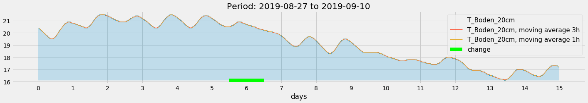

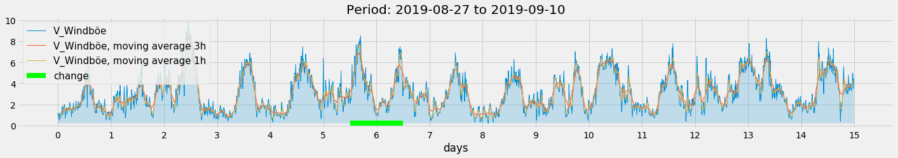

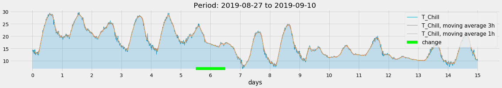

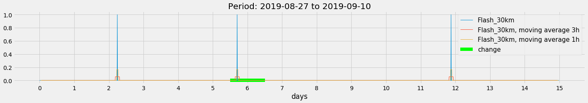

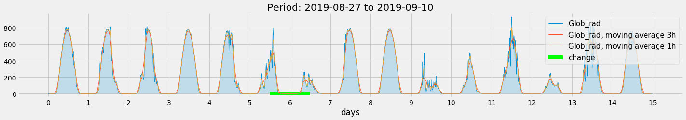

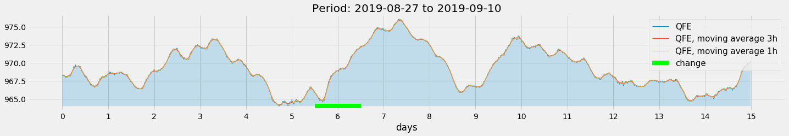

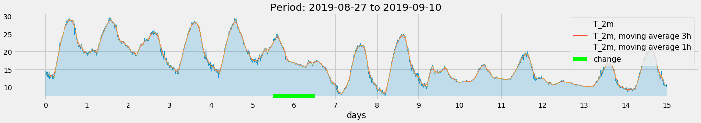

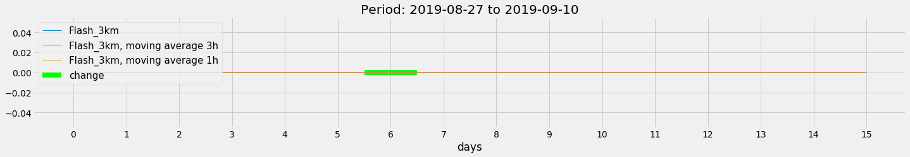

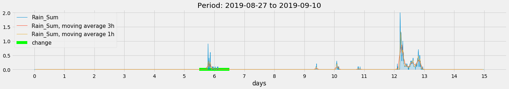

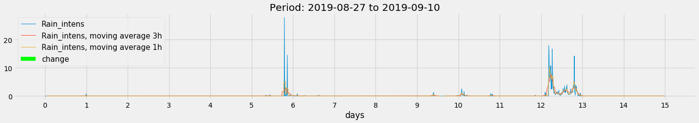

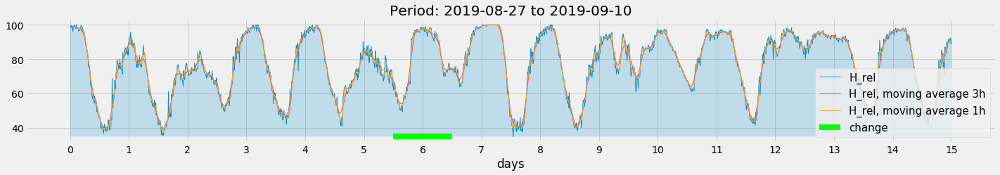

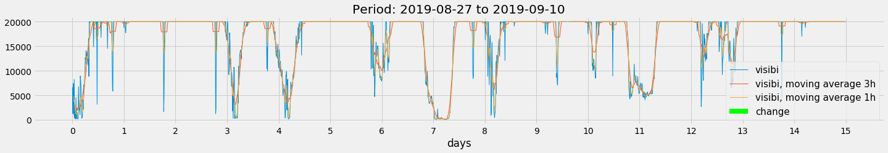

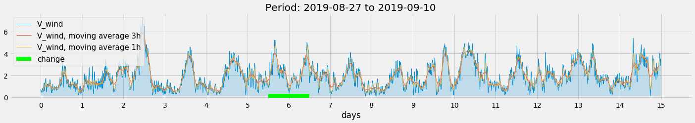

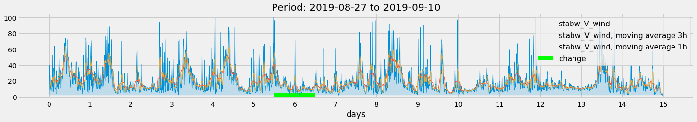

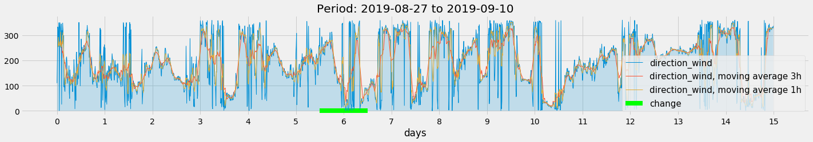

.. code:: python3

    for k in range(2,MP,1):
        print(k, dM.columns[k])

.. parsed-literal::

    2 T_Boden_20cm
    3 V_Windböe
    4 T_Chill
    5 Flash_30km
    6 Glob_rad
    7 QFE
    8 T_2m
    9 Flash_3km
    10 Rain_Sum
    11 Rain_intens
    12 H_rel
    13 visibi
    14 V_wind
    15 stabw_V_wind
    16 direction_wind

