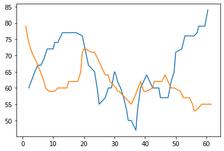

3.04 Improving Drum
===================

-  Split met\_percussion in different functions and improved them. So
   they can also be used differently.
-  Create print start end\_, drum and meteorological volume functions.
-  Weather period from 1.8.2019 to 28.8.2019

.. code:: python3

    from pyknon.genmidi import Midi
    from pyknon.music import Rest, Note, NoteSeq
    from music_generation import*
    import numpy as np
    import pandas as pd
    import matplotlib.pyplot as plt
    import matplotlib.ticker as plticker
    from datetime import date

Read Meteorological Data
~~~~~~~~~~~~~~~~~~~~~~~~

.. code:: python3

    def read_meteo_data(fName):
        colNames = ['Stao','time', 'T_Boden_20cm', 'Flash_30km', 'Glob_rad', 'QFE','T_2m','Rain_Sum','H_rel','visibi','V_wind','direction_wind']  
        df = pd.read_csv(fName,sep=';', skiprows=3, names=colNames, na_values='-')
        print(df.head())
        return df
    
    fPath = '/mnt/daten/04_Schule/42_Kanti/Matrua/Music_generation/Organisation/MeteoSchweiz/Daten/'
    fName = 'order_75330_data.txt'
    dM = read_meteo_data(fPath+fName)
    
    NT, MP = dM.shape

.. parsed-literal::

      Stao          time  T_Boden_20cm  Flash_30km  Glob_rad    QFE  T_2m  \
    0  KLO  201908010000          21.5           0         2  969.5  15.3   
    1  KLO  201908010010          21.5           0         2  969.5  14.9   
    2  KLO  201908010020          21.5           0         2  969.5  14.6   
    3  KLO  201908010030          21.5           0         2  969.5  14.6   
    4  KLO  201908010040          21.4           0         2  969.6  13.7   
    
       Rain_Sum  H_rel   visibi  V_wind  direction_wind  
    0       0.0   80.4  20000.0     0.9             117  
    1       0.0   82.4  20000.0     1.1              98  
    2       0.0   83.7  20000.0     1.0             121  
    3       0.0   82.7  20000.0     1.2             119  
    4       0.0   88.8  20000.0     1.0             173  

Chords and scales
~~~~~~~~~~~~~~~~~

.. code:: python3

    C     = np.array([ 0, 4, 7])
    Cm    = np.array([ 0, 3, 7])
    Cdim  = np.array([ 0, 3, 6])
    
    CM7   = np.array([ 0, 4, 7, 11])
    C7    = np.array([ 0, 4, 7, 10])
    Cm7   = np.array([ 0, 3, 7, 10])
    Cdim7 = np.array([ 0, 3, 6, 10])
    Cdim6 = np.array([ 0, 3, 6, 9 ])
    C6    = np.array([ 0, 4, 7, 9 ]) # inversion of Am7
    Cm6   = np.array([ 0, 3, 7, 9 ])
    
    Csus4 = np.array([ 0, 5, 7])
    Csus2 = np.array([ 0, 2, 7])
    Csus47= np.array([ 0, 5, 7, 10])
    
    P = np.array([ 0,7])  # Power chord (Perfect unison, Perfect fifth)
    B = np.array([ 0])    # Bass (Perfect unison)
    
    major = np.array([ 0, 2, 4, 5, 7, 9, 11])
    minor = np.array([ 0, 2, 3, 5, 7, 8, 10])
    blues = np.array([ 0, 3, 5, 6, 7, 10])

Drum
~~~~

-  Together with **on\_off** and **met\_vol** it replaces
   **met\_percus** of the previous version.
-  Creates a regular drum track by defining a rhythmic, note and volume
   pattern.
-  the volume can be overwritten be the **met\_vol** function.

.. code:: python3

    def drum(rythems,notes,volumes,melody_len):
        ryth_rep = int((melody_len/(np.sum(rythems)*4))+1)      # calculate repeat factor
        rythem = np.tile(rythems,ryth_rep)                      # tile  
        rythem = np.delete(rythem, np.argwhere(np.cumsum(rythem)*4 >= melody_len))  # delete not used notes
        note_nr = len(rythem)
        
        melody_rep = int(note_nr/len(notes)+1)      # calculate repeat factor
        melody = np.tile(notes,melody_rep)          # tile  
        melody = melody[:note_nr]                   # delete not used notes
        
        volume_rep = int(note_nr/len(volumes)+1)    # calculate repeat factor
        volume = np.tile(volumes,volume_rep)        # tile  
        volume = volume[:note_nr]                   # delete not used notes
    
        return melody, rythem, volume
       

Meteorological Volume
~~~~~~~~~~~~~~~~~~~~~

-  Generates out of meteorological data a Volume track.
-  Uses the rhythm to calculate the position in the meteorological data.
-  Volumes can be in or decreased by a value (add).
-  Maximum value is 127 as this is the maximum MIDI-Volume.

.. code:: python3

    def met_vol(meteo, add, rythem, mpb):
        met_resolution = 10 
        cum_ryth = np.concatenate((np.asarray([0]),np.cumsum(rythem)))[:-1]   # add 0 at beginig remove last element
        i_data = (cum_ryth * (mpb /met_resolution)).astype(int)               # calculate index of the data
        volumes = meteo[i_data].astype(int)                 # fill in meteo data
        volumes = volumes + add                             # add 
        volumes = np.minimum(volumes, 127)                  # set values bigger than 127 to 127
        return volumes

Print Start and End
~~~~~~~~~~~~~~~~~~~

-  Prints the end and starting point of the actual tune.
-  Calculates melody\_len and Start

.. code:: python3

    def print_dur(bar,bpb,mpb,s_day,s_hour,tune_name):
        start = (s_day*24)+ s_hour  # start in hours 
        melody_len = bar * bpb
        
        S_h = start%24
        S_d = start//24
        dur_h = melody_len *mpb/60
        E_h = (start+dur_h)%24
        E_d = (start+dur_h)//24
        print(tune_name+': Start:',S_d,'day',S_h,'h   End:', E_d,'day',E_h,'h')
        
        return melody_len, start
        

tune 304\_A
-----------

-  This tune is similar to the previous one. but the function used where
   changed and improved.
-  Period from 5.8 to 7.8.2019

.. code:: python3

    def tune_304_A():
        tune_name = 'tune_304_A'  
        #np.random.seed(56)
        bar, bpb      = 15, 4     # bar: Takt , bpb: beat per bar
        s_day, s_hour = 4, 18   # Start point in the data
        mpb     =  60            # minutes per beat
        end_dur =  0
        melody_len, start = print_dur(bar,bpb,mpb,s_day,s_hour,tune_name)
    
        trans = met_transform(dM,[1,1,1,4,1.3,400,0.2,1,4.5,1,],[6,6,6,6,6,24,6,6,6,2],start)
    
        scales = [[8,'C',major]]
        end_scale = [[1,'C',P]]
        pattern = pattern_gen(scales, end_scale, melody_len)
    
        # Pressure
        range_1 = liniar_range(0,0,0,0)
        rythem1, notenr_1 = ran_duration([1/32,1/8, 1/4,1/2], [0,2,3,1], melody_len, end_dur)
        melody1 = meteo_melody(trans[3],pattern, 60, range_1, notenr_1, rythem1,mpb)
        volumes1 = ran_volume([0,100], [1,8], notenr_1 )
        notes1 = NoteSeq( [Note(no,octave=0, dur=du, volume=vo) for no,du,vo in zip(melody1,rythem1,volumes1)] )
        
        # temp
        range_2 = liniar_range(0,0,0,0)
        rythem2, notenr_2 = ran_duration([1/16,1/8, 1/4,1/2], [0,2,3,2], melody_len, end_dur)
        melody2 = meteo_melody(trans[4],pattern, 80, range_2, notenr_2, rythem2,mpb)
        volumes2 = ran_volume([0,100], [1,8], notenr_2 )
        notes2 = NoteSeq( [Note(no,octave=0, dur=du, volume=vo) for no,du,vo in zip(melody2,rythem2,volumes2)] )
        
        #timpani rain
        melody3, rythem3, volumes3 = drum([1/16,1.5/16], [60,63,66],[100,127],melody_len) 
        volumes3 = met_vol(trans[5],0,rythem3, mpb)
        notes3 = NoteSeq( [Note(no,octave=0, dur=du, volume=vo) for no,du,vo in zip(melody3,rythem3,volumes3)] )
    
        instruments = [48,48,47]
        notes = [notes1,notes2,notes3]
        return notes, instruments,tune_name

.. raw:: html

     <audio controls="controls" src="https://raw.githubusercontent.com/schuhva/Music-Generation/master/doc/releases/3.04/tune_304_A.flac" type="audio/flac"></audio>
     tune_304_A
     
      
     tune_304_A     

**Instruments:** Available are at lest the 128 General-Midi (GM)
Instruments. Depending on the sound-fonts there is a bigger choice. A
list of the GM instruments can be found here.
https://jazz-soft.net/demo/GeneralMidi.html

Generate Midi and Audio file
----------------------------

.. code:: python3

    def gen_midi():
    #     squezze into a MIDI framework
        notes, instruments, tune_name = tune_304_A() #  <--- select a tune  <<--     <<<<<<<<<--- select a tune -----
        nTracks = len(notes)
        
        m = Midi(number_tracks=nTracks, tempo=120, instrument=instruments)
        for iTrack in range(nTracks):
            m.seq_notes(notes[iTrack], track=iTrack)
    
        #--- write the MIDI file -----
        midi_file_name = tune_name +'.mid'   # set the name of the file
        m.write(midi_file_name)
        return midi_file_name

.. code:: python3

    ######---  Main  ---######
    midi_file_name = gen_midi()
    
    midi_play(midi_file_name)
    midi_audio(midi_file_name)
    midi_png(midi_file_name)

.. parsed-literal::

    tune_304_A: Start: 4 day 18 h   End: 7.0 day 6.0 h

External **Music\_Generation** library
~~~~~~~~~~~~~~~~~~~~~~~~~~~~~~~~~~~~~~

This library changes from version to version. New or changed code is
first explained above. This is a copy of music\_generation.py

.. literalinclude:: music_generation.py
   :language: python

