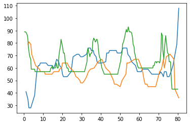

3.05 Melody On Off
==================

-  Dependent on meteorological data a voice is set on or off.
-  This is handy for a meteorological parameter like global radiation.
   At night there is no global radiation and therefore it is zero. To
   prevent that the same tone is repeated over and over again the voice
   can be paused.
-  Weather period from the 1.8.2019 to 28.8.2019

.. code:: python3

    from pyknon.genmidi import Midi
    from pyknon.music import Rest, Note, NoteSeq
    from music_generation import*
    import numpy as np
    import pandas as pd
    import matplotlib.pyplot as plt
    import matplotlib.ticker as plticker
    from datetime import date

Read Meteorological Data
~~~~~~~~~~~~~~~~~~~~~~~~

.. code:: python3

    def read_meteo_data(fName):
        colNames = ['Stao','time', 'T_Boden_20cm', 'Flash_30km', 'Glob_rad', 'QFE','T_2m','Rain_Sum','H_rel','visibi','V_wind','direction_wind']  
        df = pd.read_csv(fName,sep=';', skiprows=3, names=colNames, na_values='-')
        print(df.head())
        return df
    
    fPath = '/mnt/daten/04_Schule/42_Kanti/Matrua/Music_generation/Organisation/MeteoSchweiz/Daten/'
    fName = 'order_75330_data.txt'
    dM = read_meteo_data(fPath+fName)
    
    NT, MP = dM.shape

.. parsed-literal::

      Stao          time  T_Boden_20cm  Flash_30km  Glob_rad    QFE  T_2m  \
    0  KLO  201908010000          21.5           0         2  969.5  15.3   
    1  KLO  201908010010          21.5           0         2  969.5  14.9   
    2  KLO  201908010020          21.5           0         2  969.5  14.6   
    3  KLO  201908010030          21.5           0         2  969.5  14.6   
    4  KLO  201908010040          21.4           0         2  969.6  13.7   
    
       Rain_Sum  H_rel   visibi  V_wind  direction_wind  
    0       0.0   80.4  20000.0     0.9             117  
    1       0.0   82.4  20000.0     1.1              98  
    2       0.0   83.7  20000.0     1.0             121  
    3       0.0   82.7  20000.0     1.2             119  
    4       0.0   88.8  20000.0     1.0             173  

Chords and scales
~~~~~~~~~~~~~~~~~

.. code:: python3

    C     = np.array([ 0, 4, 7])
    Cm    = np.array([ 0, 3, 7])
    Cdim  = np.array([ 0, 3, 6])
    
    CM7   = np.array([ 0, 4, 7, 11])
    C7    = np.array([ 0, 4, 7, 10])
    Cm7   = np.array([ 0, 3, 7, 10])
    Cdim7 = np.array([ 0, 3, 6, 10])
    Cdim6 = np.array([ 0, 3, 6, 9 ])
    C6    = np.array([ 0, 4, 7, 9 ]) # inversion of Am7
    Cm6   = np.array([ 0, 3, 7, 9 ])
    
    Csus4 = np.array([ 0, 5, 7])
    Csus2 = np.array([ 0, 2, 7])
    Csus47= np.array([ 0, 5, 7, 10])
    
    P = np.array([ 0,7])  # Power chord (Perfect unison, Perfect fifth)
    B = np.array([ 0])    # Bass (Perfect unison)
    
    major = np.array([ 0, 2, 4, 5, 7, 9, 11])
    minor = np.array([ 0, 2, 3, 5, 7, 8, 10])
    blues = np.array([ 0, 3, 5, 6, 7, 10])

on\_off
~~~~~~~

-  Mutes and unmutes voices dependent of the meteorological input data.
-  With on\_range defines when a voice plays.
-  on\_off is applied after the met\_transform. So the on\_range must be
   adjusted accordingly.

.. code:: python3

    def on_off(meteo, on_range, volumes, rythem, mpb):
        met_resolution = 10 
        cum_ryth = np.concatenate((np.asarray([0]),np.cumsum(rythem)))[:-1]   # add 0 at beginig remove last element
        i_data = (cum_ryth*4 * (mpb /met_resolution)).astype(int)               # calculate index of the data
        for npn in range(len(i_data)):                  
            value = meteo[ i_data[npn] ]                  # get value of the meteo data
            if on_range[0] < value < on_range[1]: pass    # do nothing when in on_range
            else:  volumes[npn] = 0                       # set volume to zero when out of range
        
        return volumes

tune 305\_A
-----------

-  Period from the 11.8 to 15.8.2019.
-  Temperature and pressure played by pianos.
-  Timpani regulated by the rain.
-  A Music box plays the melody of the global radiation. During night
   the melody is paused.

.. code:: python3

    def tune_305_A():
        tune_name = 'tune_305_A'  
        np.random.seed(80)
        bar, bpb      = 20, 4     # bar: Takt , bpb: beat per bar
        s_day, s_hour = 10, 12   # Start point in the data
        mpb     =  80            # minutes per beat
        end_dur =  0
        melody_len, start = print_dur(bar,bpb,mpb,s_day,s_hour,tune_name)
    
        trans = met_transform(dM,[1,1,0.025,3,1.3,500,0.2,1,4.5,1,],[6,6,6,6,6,24,6,6,6,2],start)
        
        scales = [[8,'C',major]]
        end_scale = [[1,'C',P]]
        pattern = pattern_gen(scales, end_scale, melody_len)
    
        # Pressure
        rythem1, notenr_1 = ran_duration([1/32,1/8, 1/4,1/2], [0,2,3,1], melody_len, end_dur)
        melody1 = meteo_melody(trans[3],pattern, 42, notenr_1, rythem1,mpb)
        volumes1 = ran_volume([0,90], [1,8], notenr_1 )
        notes1 = NoteSeq( [Note(no,octave=0, dur=du, volume=vo) for no,du,vo in zip(melody1,rythem1,volumes1)] )
        
        # temp
        rythem2, notenr_2 = ran_duration([1/16,1/8, 1/4,1/2], [0,2,3,2], melody_len, end_dur)
        melody2 = meteo_melody(trans[4],pattern, 80, notenr_2, rythem2,mpb)
        volumes2 = ran_volume([0,90], [1,8], notenr_2 )
        notes2 = NoteSeq( [Note(no,octave=0, dur=du, volume=vo) for no,du,vo in zip(melody2,rythem2,volumes2)] )
        
        #timpani rain
        melody3, rythem3, volumes3 = drum([1/16], [60,63],[100,127],melody_len) 
        volumes3 = met_vol(trans[5],0,rythem3, mpb)
        notes3 = NoteSeq( [Note(no,octave=0, dur=du, volume=vo) for no,du,vo in zip(melody3,rythem3,volumes3)] )
        
        # glob radation
        rythem4, notenr_4 = ran_duration([1/32,1/16,1/8, 1/4,], [0,3,1,0], melody_len, end_dur)
        melody4 = meteo_melody(trans[2],pattern, 90, notenr_4, rythem4, mpb)
        volumes4 = ran_volume([0,80], [0,8], notenr_4 )
        volumes4 = on_off(trans[2],[5,20000],volumes4, rythem4, mpb)
        notes4 = NoteSeq( [Note(no,octave=0, dur=du, volume=vo) for no,du,vo in zip(melody4,rythem4,volumes4)] )
        
        instruments = [0,0,47,10]
        notes = [notes1,notes2,notes3,notes4]
        return notes, instruments,tune_name

.. raw:: html

     <audio controls="controls" src="https://raw.githubusercontent.com/schuhva/Music-Generation/master/doc/releases/3.05/tune_305_A.flac" type="audio/flac"></audio>
     tune_305_A
     
      
     tune_305_A     

**Instruments:** Available are at lest the 128 General-Midi (GM)
Instruments. Depending on the sound-fonts there is a bigger choice. A
list of the GM instruments can be found here.
https://jazz-soft.net/demo/GeneralMidi.html

Generate Midi and Audio file
----------------------------

.. code:: python3

    def gen_midi():
    #     squezze into a MIDI framework
        notes, instruments, tune_name = tune_305_A() #  <--- select a tune  <<--     <<<<<<<<<--- select a tune -----
        nTracks = len(notes)
        
        m = Midi(number_tracks=nTracks, tempo=120, instrument=instruments)
        for iTrack in range(nTracks):
            m.seq_notes(notes[iTrack], track=iTrack)
    
        #--- write the MIDI file -----
        midi_file_name = tune_name +'.mid'   # set the name of the file
        m.write(midi_file_name)
        return midi_file_name

.. code:: python3

    ######---  Main  ---######
    midi_file_name = gen_midi()
    
    midi_play(midi_file_name)
    midi_audio(midi_file_name)
    midi_png(midi_file_name)

.. parsed-literal::

    tune_305_A: Start: 10 day 12 h   End: 14.0 day 22.666666666666686 h

External **Music\_Generation** library
~~~~~~~~~~~~~~~~~~~~~~~~~~~~~~~~~~~~~~

This library changes from version to version. New or changed code is
first explained above. This is a copy of music\_generation.py

.. literalinclude:: music_generation.py
   :language: python
