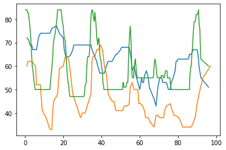

3.06 Meteorological Harmony Change
==================================

-  With the introduction of **harm\_change** the harmony pattern can be
   changed by the meteorological data. The two pattern are still defined
   by hand, but when the pattern are switched, is controlled by the
   weather measurements. The pattern are only changed once.
-  Weather Period from 1.8.2019 to 28.8.2019

.. code:: python3

    from pyknon.genmidi import Midi
    from pyknon.music import Rest, Note, NoteSeq
    from music_generation import*
    import numpy as np
    import pandas as pd
    import matplotlib.pyplot as plt
    import matplotlib.ticker as plticker
    from datetime import date

Read Meteorological Data
~~~~~~~~~~~~~~~~~~~~~~~~

.. code:: python3

    def read_meteo_data(fName):
        colNames = ['Stao','time', 'T_Boden_20cm', 'Flash_30km', 'Glob_rad', 'QFE','T_2m','Rain_Sum','H_rel','visibi','V_wind','direction_wind']  
        df = pd.read_csv(fName,sep=';', skiprows=3, names=colNames, na_values='-')
        print(df.head())
        return df
    
    fPath = '/mnt/daten/04_Schule/42_Kanti/Matrua/Music_generation/Organisation/MeteoSchweiz/Daten/'
    fName = 'order_75330_data.txt'
    dM = read_meteo_data(fPath+fName)
    
    NT, MP = dM.shape

.. parsed-literal::

      Stao          time  T_Boden_20cm  Flash_30km  Glob_rad    QFE  T_2m  \
    0  KLO  201908010000          21.5           0         2  969.5  15.3   
    1  KLO  201908010010          21.5           0         2  969.5  14.9   
    2  KLO  201908010020          21.5           0         2  969.5  14.6   
    3  KLO  201908010030          21.5           0         2  969.5  14.6   
    4  KLO  201908010040          21.4           0         2  969.6  13.7   
    
       Rain_Sum  H_rel   visibi  V_wind  direction_wind  
    0       0.0   80.4  20000.0     0.9             117  
    1       0.0   82.4  20000.0     1.1              98  
    2       0.0   83.7  20000.0     1.0             121  
    3       0.0   82.7  20000.0     1.2             119  
    4       0.0   88.8  20000.0     1.0             173  

Chords and scales
~~~~~~~~~~~~~~~~~

.. code:: python3

    C     = np.array([ 0, 4, 7])
    Cm    = np.array([ 0, 3, 7])
    Cdim  = np.array([ 0, 3, 6])
    
    CM7   = np.array([ 0, 4, 7, 11])
    C7    = np.array([ 0, 4, 7, 10])
    Cm7   = np.array([ 0, 3, 7, 10])
    Cdim7 = np.array([ 0, 3, 6, 10])
    Cdim6 = np.array([ 0, 3, 6, 9 ])
    C6    = np.array([ 0, 4, 7, 9 ]) # inversion of Am7
    Cm6   = np.array([ 0, 3, 7, 9 ])
    
    Csus4 = np.array([ 0, 5, 7])
    Csus2 = np.array([ 0, 2, 7])
    Csus47= np.array([ 0, 5, 7, 10])
    
    P = np.array([ 0,7])  # Power chord (Perfect unison, Perfect fifth)
    B = np.array([ 0])    # Bass (Perfect unison)
    
    major = np.array([ 0, 2, 4, 5, 7, 9, 11])
    minor = np.array([ 0, 2, 3, 5, 7, 8, 10])
    blues = np.array([ 0, 3, 5, 6, 7, 10])

Harmony Change
~~~~~~~~~~~~~~

The **Harm\_Change** function replaces the **pattern\_gen** function.
Harm\_Change calls the pattern\_gen function for creating the pattern.
It assembles two pattern dependent on meteorological data input. When
the data reaches a manually defined value the first time, the pattern is
changed. The Pattern changes only once. The end scale functionalities
are still in use. When a harmony change by meteorological data is not
desired, the pattern\_gen function is also available for further use.

.. code:: python3

    def harm_change(meteo,value,scale1,scale2,end_scale,melody_len,mpb):
        met_resolution = 10
        end_zero = [[0,'C',B]]                     #  Fake end for pattern1
        i_when = (np.argwhere(meteo>=value))[0,0]  # Find where value is reached first time
        b_when = i_when*met_resolution/mpb         # calculate in to beat_nr    
        if b_when >= melody_len:                   # when Change is out of song length
            print('No pattern Change')
            pattern_add = pattern_gen(scale1, end_scale, melody_len)
            
        else:
            pattern1 = pattern_gen(scale1, end_zero, b_when)               # pattern_gen 1
            pattern2 = pattern_gen(scale2, end_scale, melody_len - b_when) # pattern_gen 2 
            pattern2[:,0] = pattern2[:,0] + b_when                         # add b_when to the change times of second pattern
            pattern_add = np.concatenate((pattern1,pattern2),axis=0)       # merge both patterns
        return pattern_add

tune 306\_A
-----------

-  period from 11.8 to 15.8.2019
-  Temperature and pressure played is played by Heckelphone and
   Clarinet.
-  Timpani volume is regulated by the rain.
-  A music box plays the melody of the global radiation. During night
   the melody is paused.
-  The numbers of flashes changes the chord pattern. The first time when
   15 flashes per ten minutes are reached the scale is switched from
   major to minor. It would be possible to change a harmony pattern and
   not only two scales.

.. code:: python3

    def tune_306_A():
        tune_name = 'tune_306_A'  
        np.random.seed(54)  #50
        bar, bpb      = 23, 4     # bar: Takt , bpb: beat per bar
        s_day, s_hour = 2, 12   # Start point in the data
        mpb     =  80            # minutes per beat
        end_dur =  1
        melody_len, start = print_dur(bar,bpb,mpb,s_day,s_hour,tune_name)
    
        trans = met_transform(dM,[1,1,0.025,3,1.3,400,0.2,1,4.5,1,],[6,6,6,6,6,12,6,6,6,2],start)
        
        scale1 = [[8,'C',major]]
        scale2 = [[8,'C',minor]]
        end_scale = [[0.5,'C',Cm]]
        # Flash for changing Chord pattern
        pattern = harm_change(trans[1],15,scale1,scale2,end_scale,  melody_len,mpb)
    
        # Pressure
        rythem1, notenr_1 = ran_duration([1/32,1/8, 1/4,1/2], [0,2,3,1], melody_len, end_dur)
        melody1 = meteo_melody(trans[3],pattern, 72, notenr_1, rythem1,mpb)
        volumes1 = ran_volume([0,115], [1,8], notenr_1 )
        notes1 = NoteSeq( [Note(no,octave=0, dur=du, volume=vo) for no,du,vo in zip(melody1,rythem1,volumes1)] )
        
        # temp
        rythem2, notenr_2 = ran_duration([1/16,1/8, 1/4,1/2], [0,2,3,2], melody_len, end_dur)
        melody2 = meteo_melody(trans[4],pattern, 60, notenr_2, rythem2,mpb)
        volumes2 = ran_volume([0,115], [1,8], notenr_2 )
        notes2 = NoteSeq( [Note(no,octave=0, dur=du, volume=vo) for no,du,vo in zip(melody2,rythem2,volumes2)] )
        
        #timpani rain
        melody3, rythem3, volumes3 = drum([1/16], [60,63],[100,127],melody_len) 
        volumes3 = met_vol(trans[5],0,127,rythem3, mpb)
        notes3 = NoteSeq( [Note(no,octave=0, dur=du, volume=vo) for no,du,vo in zip(melody3,rythem3,volumes3)] )
        
        # glob radation
        rythem4, notenr_4 = ran_duration([1/32,1/16,1/8, 1/4,], [0,3,1,0], melody_len, end_dur)
        melody4 = meteo_melody(trans[2],pattern, 85, notenr_4, rythem4, mpb)
        volumes4 = ran_volume([0,110], [0,8], notenr_4 )
        volumes4 = on_off(trans[2],[5,20000],volumes4, rythem4, mpb)
        notes4 = NoteSeq( [Note(no,octave=0, dur=du, volume=vo) for no,du,vo in zip(melody4,rythem4,volumes4)] )
        
        instruments = [68,71,47,10]
        notes = [notes1,notes2,notes3,notes4]
        return notes, instruments,tune_name

.. raw:: html

     <audio controls="controls" src="https://raw.githubusercontent.com/schuhva/Music-Generation/master/doc/releases/3.06/tune_306_A.flac" type="audio/flac"></audio>
     tune_306_A
     
      
     tune_306_A     

**Instruments:** Available are at lest the 128 General-Midi (GM)
Instruments. Depending on the sound-fonts there is a bigger choice. A
list of the GM instruments can be found here.
https://jazz-soft.net/demo/GeneralMidi.html

Generate Midi and Audio file
----------------------------

.. code:: python3

    def gen_midi():
    #     squezze into a MIDI framework
        notes, instruments, tune_name = tune_306_A() #  <--- select a tune  <<--     <<<<<<<<<--- select a tune -----
        nTracks = len(notes)
        
        m = Midi(number_tracks=nTracks, tempo=120, instrument=instruments)
        for iTrack in range(nTracks):
            m.seq_notes(notes[iTrack], track=iTrack)
    
        #--- write the MIDI file -----
        midi_file_name = tune_name +'.mid'   # set the name of the file
        m.write(midi_file_name)
        return midi_file_name

.. code:: python3

    ######---  Main  ---######
    midi_file_name = gen_midi()
    
    midi_play(midi_file_name)
    midi_audio(midi_file_name)
    midi_png(midi_file_name)

.. parsed-literal::

    tune_306_A: Start: 2 day 12 h   End: 7.0 day 14.666666666666686 h

External **Music\_Generation** library
~~~~~~~~~~~~~~~~~~~~~~~~~~~~~~~~~~~~~~

This library changes from version to version. New or changed code is
first explained above. This is a copy of music\_generation.py

.. literalinclude:: music_generation.py
   :language: python
